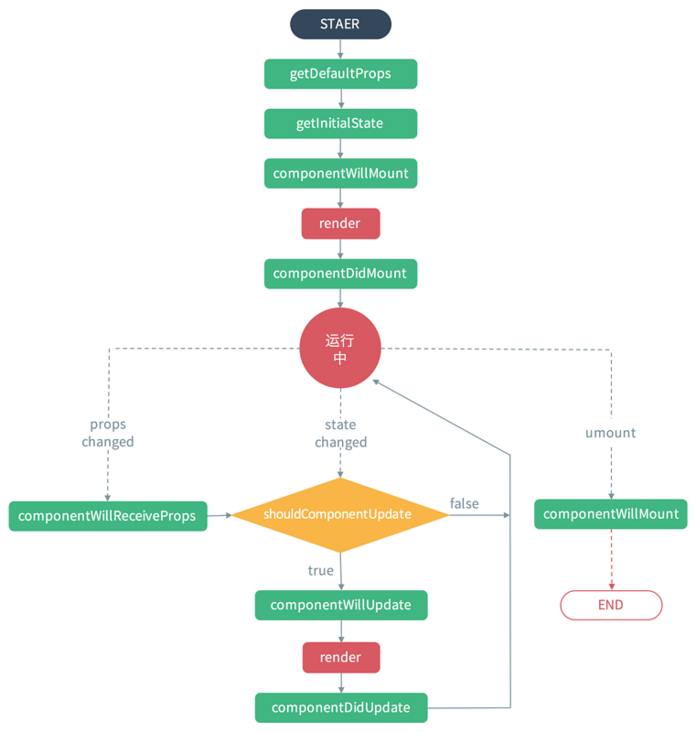
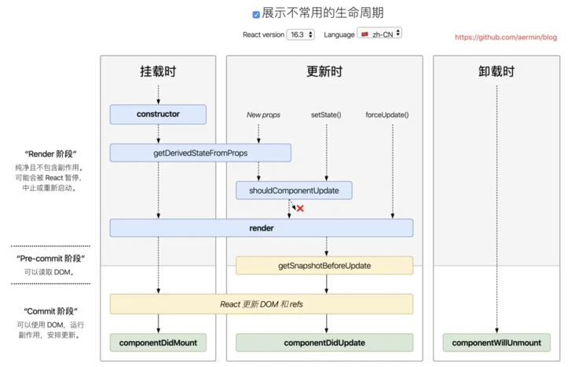
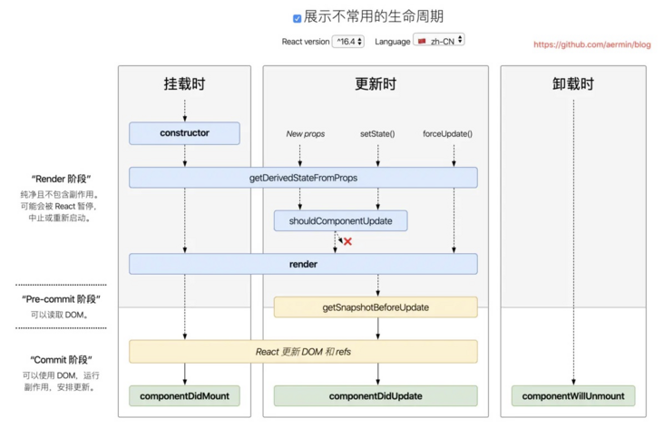

# react 的生命周期

## 1. 组件生命周期的三个阶段

1. `Mounting`（加载阶段）
2. `Updating`（更新阶段）
3. `Unmounting`（卸载阶段）

## 2. 旧的生命周期



### 2.1 Mounting（加载阶段：涉及 6 个钩子函数）

#### constructor()

加载的时候调用一次，可以初始化 `state`

#### getDefaultProps()

设置默认的 `props`，也可以用 `dufaultProps` 设置组件的默认属性。

#### getInitialState()

初始化 `state`，可以直接在 `constructor` 中定义 `this.state`

#### componentWillMount()

组件加载时只调用，以后组件更新不调用，整个生命周期只调用一次，此时可以修改 `state`

#### render()

`react` 最重要的步骤，创建虚拟 `dom`，进行 `diff` 算法，更新 `dom` 树都在此进行

#### componentDidMount()

组件渲染之后调用，只调用一次

### 2.2 Updating（更新阶段：涉及 5 个钩子函数）

#### componentWillReceiveProps(nextProps)

组件加载时不调用，组件接受新的 `props` 时调用

#### shouldComponentUpdate(nextProps, nextState)

组件接收到新的 `props` 或者 `state` 时调用，`return true` 就会更新 dom（使用 diff 算法更新），`return false` 能阻止更新（不调用 `render`）

#### componentWillUpdata(nextProps, nextState)

组件加载时不调用，只有在组件将要更新时才调用，此时可以修改 `state`

#### render()

`react` 最重要的步骤，创建虚拟 `dom`，进行 `diff` 算法，更新 `dom` 树都在此进行

#### componentDidUpdate(prevProps, prevState)

组件加载时不调用，组件更新完成后调用

### 2.3 Unmounting（卸载阶段：涉及 1 个钩子函数）

#### componentWillUnmount()

组件渲染之后调用，只调用一次

#### 组件的基本写法

```javascript
import React, { Component } from 'react'

export default class OldReactComponent extends Component {
  constructor(props) {
    super(props)
    // getDefaultProps：接收初始props
    // getInitialState：初始化state
  }
  state = {}
  componentWillMount() {
    // 组件挂载前触发
  }
  render() {
    return <h2>Old React.Component</h2>
  }
  componentDidMount() {
    // 组件挂载后触发
  }
  componentWillReceiveProps(nextProps) {
    // 接收到新的props时触发
  }
  shouldComponentUpdate(nextProps, nextState) {
    // 组件Props或者state改变时触发，true：更新，false：不更新
    return true
  }
  componentWillUpdate(nextProps, nextState) {
    // 组件更新前触发
  }
  componentDidUpdate() {
    // 组件更新后触发
  }
  componentWillUnmount() {
    // 组件卸载时触发
  }
}
```

## 3. 新的生命周期

### 3.1 Mounting（加载阶段：涉及 4 个钩子函数）

#### constructor()

加载的时候调用一次，可以初始化`state`

#### static getDerivedStateFromProps(props, state)

组件每次被 `rerender` 的时候，包括在组件构建之后(虚拟 `dom` 之后，实际 `dom` 挂载之前)，每次获取新的 `props` 或 `state` 之后；每次接收新的 `props` 之后都会返回一个对象作为新的 `state`，返回 `null` 则说明不需要更新 `state`；配合 `componentDidUpdate`，可以覆盖 `componentWillReceiveProps` 的所有用法

#### render()

`react` 最重要的步骤，创建虚拟 `dom`，进行`diff` 算法，更新 `dom` 树都在此进行

#### componentDidMount()

组件渲染之后调用，只调用一次

### 3.2 Updating（更新阶段：涉及 5 个钩子函数）

#### static getDerivedStateFromProps(props, state)

组件每次被 `rerender` 的时候，包括在组件构建之后(虚拟 `dom` 之后，实际 `dom` 挂载之前)，每次获取新的 `props` 或 `state` 之后；每次接收新的 `props` 之后都会返回一个对象作为新的 `state`，返回 `null` 则说明不需要更新 `state`；配合 `componentDidUpdate`，可以覆盖 `componentWillReceiveProps` 的所有用法

#### shouldComponentUpdate(nextProps, nextState)

组件接收到新的 `props` 或者 `state` 时调用，`return true` 就会更新 dom（使用 diff 算法更新），`return false` 能阻止更新（不调用 render）

#### render()

`react` 最重要的步骤，创建虚拟 `dom`，进行`diff` 算法，更新 `dom` 树都在此进行

#### getSnapshotBeforeUpdate(prevProps, prevState)

触发时间: `update` 发生的时候，在 `render` 之后，在组件 `dom` 渲染之前；返回一个值，作为 `componentDidUpdate` 的第三个参数；配合 `componentDidUpdate`, 可以覆盖 `componentWillUpdate` 的所有用法

#### componentDidUpdate(prevProps, prevState, snapshot)

组件加载时不调用，组件更新完成后调用

### 3.3 Unmounting（卸载阶段：涉及 1 个钩子函数）

组件渲染之后调用，只调用一次

### 3.4 Error Handling(错误处理)

#### componentDidCatch(error，info)

任何一处的 `javascript` 报错会触发

#### 组件的基本写法

```javascript
import React, { Component } from 'react'

export default class NewReactComponent extends Component {
  constructor(props) {
    super(props)
    // getDefaultProps：接收初始props
    // getInitialState：初始化state
  }
  state = {}
  static getDerivedStateFromProps(props, state) {
    // 组件每次被rerender的时候，包括在组件构建之后(虚拟dom之后，实际dom挂载之前)，每次获取新的props或state之后；;每次接收新的props之后都会返回一个对象作为新的state，返回null则说明不需要更新state
    return state
  }
  componentDidCatch(error, info) {
    // 获取到javascript错误
  }
  render() {
    return <h2>New React.Component</h2>
  }
  componentDidMount() {
    // 挂载后
  }
  shouldComponentUpdate(nextProps, nextState) {
    // 组件Props或者state改变时触发，true：更新，false：不更新
    return true
  }
  getSnapshotBeforeUpdate(prevProps, prevState) {
    // 组件更新前触发
  }
  componentDidUpdate() {
    // 组件更新后触发
  }
  componentWillUnmount() {
    // 组件卸载时触发
  }
}
```

## 总结

**旧的生命周期**


**新的生命周期**

React16.3 生命周期



React16.4+生命周期



1. React16 新的生命周期弃用了 `componentWillMount`、`componentWillReceiveProps`，`componentWillUpdate`
2. 新增了 `getDerivedStateFromProps`、`getSnapshotBeforeUpdate`来代替弃用的三个钩子函数（`componentWillMount`、`componentWillReceiveProps`，`componentWillUpdate`）
3. React16 并没有删除这三个钩子函数，但是不能和新增的钩子函数（`getDerivedStateFromProps`、`getSnapshotBeforeUpdate`）混用，React17 将会删除 `componentWillMount`、`componentWillReceiveProps`，`componentWillUpdate`
4. 新增了对错误的处理（`componentDidCatch`）
 
 
 <git-talk/>