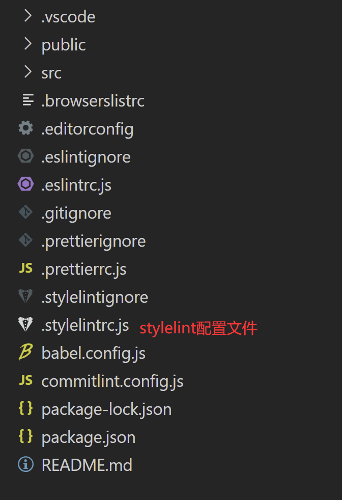
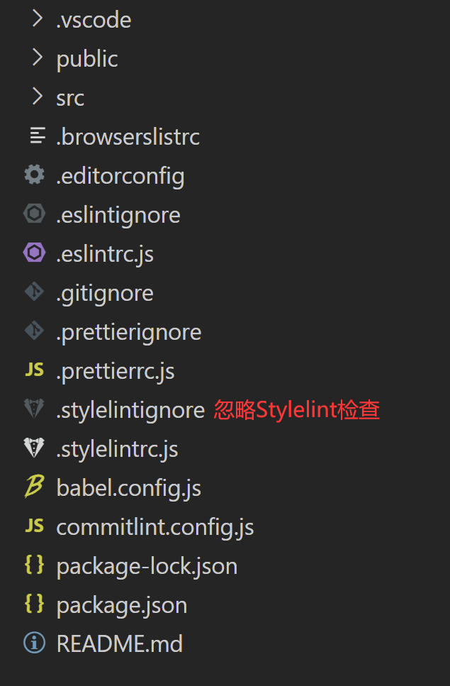
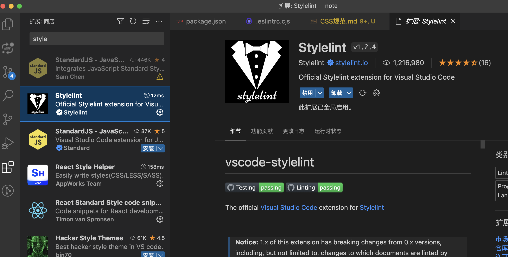

# CSS 规范（Stylelint）

## 1. Stylelint 介绍及安装

### 1.1 什么是 Stylelint

Stylelint 是一个强大的，现代的代码检查工具，与 ESLint 类似，Stylelint 能够通过定义一系列的编码风格规则帮助我们避免在样式表中出现错误。

目前在开源社区上，关于 CSS Lint 的解决方案主要包括了 csslint、SCSS-Lint 和 Stylelint 等几种。而由于 Stylelint 在技术架构上基于 AST 的方式扩展 CSS，除原生 CSS 语法，其也支持 SCSS、Less 这类预处理器，并且也有非常多的第三方插件，因此我们团队选择了 Stylelint 作为 CSS Lint 工具。

官方文档：<https://stylelint.io/>

### 1.2 安装 Stylelint

- stylelint：核心包
- stylelint-config-standard：共享的常见的css书写规范（标准）
- stylelint-config-recommended：共享的常见的css书写规范（推荐）
- stylelint-config-recommended-scss:推荐的scss增强
- stylelint-config-recommended-vue:推荐的vue增强
- stylelint-config-prettier：关闭所有不必要的或者有可能与Prettier冲突的规则
- stylelint-order：提供给css属性排序的功能
- postcss：postcss-html 的依赖包，可以用于转换 css 代码
- postcss-html：用于解析 HTML（和类似 HTML）的 PostCSS 语法，可以用于识别 html 或者 vue 中的样式
- stylelint-config-html：Stylelint 的可共享 HTML 配置。

```bash
npm i -D stylelint stylelint-config-standard stylelint-config-recommended stylelint-config-recommended-vue stylelint-config-prettier stylelint-order postcss postcss-html stylelint-config-html
```

### 1.3 安装适配预处理语法的插件

如果我们项目中采用了如 sass 或 less 等 css 预处理器，那么可以安装适配预处理语法的插件。以 sass 为例，需要安装 stylelint-scss 插件。

```bash
npm install stylelint-scss --save-dev
```

## 2. Stylelint 配置

### 2.1 Stylelint 配置方式

安装好 Stylelint 之后，就需要对 Stylelint 进行配置。Stylelint 的配置方式包括了以下几种：

- 在 package.json 中添加 stylelint 属性并添加规则
- 在.stylelintrc 文件中指定，.stylelintrc 文件支持添加一个文件扩展名来区分 JSON，YAML 或 JS 格式，如创建.stylelintrc.json、.stylelintrc.yaml、.stylelintrc.yml 或.stylelintrc.js 文件
- 在 stylelint.config.js 文件中指定，该文件将会 exports 一个配置对象

  在这里，我们选择了在项目根目录创建.stylelintrc.js 来配置 Stylelint。

  

  在.stylelintrc.js 文件中，我们可以指定要配置的内容，下面给出了一个配置文件的例子。

  其中，该配置文件采用了 stylelint-config-standard 标准配置，并且添加了 stylelint-order 插件用于 CSS 属性排序，在 rules 中，可以指定声明块内属性的顺序，也可以自定义 CSS 检查规则。比如定义了 color-hex-case 为 lower，表示 CSS 文件的颜色值都必须小写，否则会报错。
  
  依赖安装：
  
  ```json
   "devDependencies": {
      "postcss": "^8.4.12",
      "postcss-html": "^1.3.0",
      "stylelint": "^14.6.0",
      "stylelint-config-html": "^1.0.0",
      "stylelint-config-prettier": "^9.0.3",
      "stylelint-config-recommended": "^7.0.0",
      "stylelint-config-recommended-less": "^1.0.4",
      "stylelint-config-recommended-scss": "^7.0.0",
      "stylelint-config-recommended-vue": "^1.4.0",
      "stylelint-config-standard": "^25.0.0",
      "stylelint-config-standard-scss": "^4.0.0",
      "stylelint-less": "^1.0.5",
      "stylelint-order": "^5.0.0",
  }
  ```
  
  

```js
module.exports = {
  extends: [
    'stylelint-config-standard',
    'stylelint-config-prettier',
    'stylelint-config-html/vue',
    'stylelint-config-recommended-vue/scss',
    'stylelint-config-recommended-less',
    'stylelint-config-recommended-scss',
 
  ],
  plugins: ['stylelint-order'],
  overrides: [
    {
      "files": ["**/*.vue"],
      "customSyntax": "postcss-html"
    }
  ],
  ignoreFiles: ['**/*.js', '**/*.jsx', '**/*.tsx', '**/*.ts', '**/*.json', ],
  rules: {
    indentation: 2,
    'selector-pseudo-element-no-unknown': [
      true,
      {
        ignorePseudoElements: ['v-deep', ':deep']
      }
    ],
    'number-leading-zero': 'always',
    'no-descending-specificity': null,
    'function-url-quotes': 'always',
    'string-quotes': 'single',
    'unit-case': null,
    'color-hex-case': 'lower',
    'color-hex-length': 'long',
    'rule-empty-line-before': 'never',
    'font-family-no-missing-generic-family-keyword': null,
    'selector-type-no-unknown': null,
    'block-opening-brace-space-before': 'always',
    'at-rule-no-unknown': null,
    'no-duplicate-selectors': null,
    'property-no-unknown': null,
    'no-empty-source': null,
    'selector-class-pattern': null,
    'keyframes-name-pattern': null,
    'selector-pseudo-class-no-unknown': [
      true,
      { ignorePseudoClasses: ['global', 'deep'] }
    ],
    'function-no-unknown': null,
    'order/properties-order': [
      'position',
      'top',
      'right',
      'bottom',
      'left',
      'z-index',
      'display',
      'justify-content',
      'align-items',
      'float',
      'clear',
      'overflow',
      'overflow-x',
      'overflow-y',
      'margin',
      'margin-top',
      'margin-right',
      'margin-bottom',
      'margin-left',
      'padding',
      'padding-top',
      'padding-right',
      'padding-bottom',
      'padding-left',
      'width',
      'min-width',
      'max-width',
      'height',
      'min-height',
      'max-height',
      'font-size',
      'font-family',
      'font-weight',
      'border',
      'border-style',
      'border-width',
      'border-color',
      'border-top',
      'border-top-style',
      'border-top-width',
      'border-top-color',
      'border-right',
      'border-right-style',
      'border-right-width',
      'border-right-color',
      'border-bottom',
      'border-bottom-style',
      'border-bottom-width',
      'border-bottom-color',
      'border-left',
      'border-left-style',
      'border-left-width',
      'border-left-color',
      'border-radius',
      'text-align',
      'text-justify',
      'text-indent',
      'text-overflow',
      'text-decoration',
      'white-space',
      'color',
      'background',
      'background-position',
      'background-repeat',
      'background-size',
      'background-color',
      'background-clip',
      'opacity',
      'filter',
      'list-style',
      'outline',
      'visibility',
      'box-shadow',
      'text-shadow',
      'resize',
      'transition'
    ]
  }
};
```

### 2.2 Stylelint 配置项

在上面的配置文件中，我们主要定义了一个配置对象，接下来将对常用的配置项进行介绍。

**（1）plugins**

plugins 定义了一个数组，该配置项允许我们使用第三方插件，在该数组中，需要包含“定位器”标识出你要使用的插件，一个“定位器”可以是一个 npm 模块名，一个绝对路径，或一个相对于要调用的配置文件的路径。

一旦声明了插件，在 rules 中需要为插件的规则添加选项，就像其他标准的规则一样。你需要查看插件的文档去了解规则的名称。

```json
{
  "plugins": ["stylelint-order", "../special-rule.js"],
  "rules": {
    "order/properties-order": [],
    "plugin/special-rule": "everything"
  }
}
```

**（2）extends**

extends 定义了一个数组，该配置项允许我们 extend 一个已存在的配置文件(无论是你自己的还是第三方的配置)。当一个配置继承了里一个配置，它将会添加自己的属性并覆盖原有的属性。比如下面的代码，我们就 extend 了 Stylelint 的标准配置。

```json
{
  "extends": "stylelint-config-standard",
  "rules": {
    "indentation": "tab",
    "number-leading-zero": null
  }
}
```

如果 extends 中包含多个配置项，那么数组中的每一项都优先于前一项，也就是说第二项会覆盖第一项，第三项会覆盖第一项和第二项，最后一项将覆盖其它所有项。

```json
{
  "extends": ["stylelint-config-standard", "./myExtendableConfig"],
  "rules": {
    "indentation": "tab"
  }
}
```

**（3）rules**

rules 定义了一个对象，属性名为规则名称，属性值为规则取值，它告诉 Stylelint 该检查什么，该怎么报错，所有的[规则](https://stylelint.io/user-guide/rules/list)都是默认关闭的。我们可以通过该选项开启相应规则，进行相应的检测。所有规则必须显式的进行配置，因为没有默认值。

规则名称主要由两个部分组成，第一部分描述该规则应用于什么东西，第二部分表示该规则检查了什么。

```bash
'number-leading-zero'
// ↑          ↑
// the thing  what the rule is checking
```

当规则名称应用于整个样式表时只包含第二个部分：

```bash
'no-eol-whitespace'
'indentation'
//    ↑
// what the rules are checking
```

当规则名称不同时，规则取值也不同。我们可以将某个规则设置为 null 禁用该规则。

```json
{
  "rules": {
    "at-rule-blacklist": [],
    "at-rule-empty-line-before": "never",
    "at-rule-name-case": "lower",
    "block-no-empty": null
  }
}
```

除了规则本身的取值之外，Stylelint 还支持一些自定义配置，允许给规则传递一个数组，数组第一项是规则取值，第二项是自定义配置。

```js
"selector-pseudo-class-no-unknown": [true, {
  "ignorePseudoClasses": ["global"]
}]
```

通过自定义配置，我们可以指定：

- severity：错误级别，取值为”warning"或"error"，默认情况下，所有规则的错误级别都为"error"，通过 defatuleServerity，可以修改错误级别的默认值

```json
// error-level severity examples
{ "indentation": 2 }
{ "indentation": [2] }

// warning-level severity examples
{ "indentation": [2, { "severity": "warning" } ] }
{ "indentation": [2, {
    "except": ["value"],
    "severity": "warning"
  }]
}
```

- message：当一个规则被触发时，如果你想实现一个自定义的消息，可以给规则的传递"message“作为第二选项，如果提供，将替代提供的任何标准的消息。例如，以下规则配置会使用一些自定义的消息：

```json
  "color-hex-case": [ "lower", {
    "message": "Lowercase letters are easier to distinguish from numbers"
  } ],
  "indentation": [ 2, {
    "ignore": ["block"],
    "message": "Please use 2 spaces for indentation. Tabs make The Architect grumpy.",
    "severity": "warning"
  } ]
```

**（4）processors**

Processors 是 Stylelint 的钩子函数，只能用在命令行和 Node API，不适用于 PostCSS 插件。Processors 可以使 Stylelint 检测非样式表文件中的 CSS。例如，可以检测 HTML 内中`<style`>标签中的 CSS，Markdown 文件中代码块或 JavaScript 中的字符串。

使用 Processors 的话，需要在配置中添加一个”processors“数组，包含“定位器”标识出你要使用的 processors。同上面的 extends，一个“定位器”可以是一个 npm 模块名，一个绝对路径，或一个相对于要调用的配置文件的路径。

```json
{
  "processors": ["stylelint-html-processor"],
  "rules": {}
}
```

如果你的 processor 有选项，把它们放到一个数组里，第一项是“定位器”，第二项是选项对象。

```json
{
  "processors": ["stylelint-html-processor", ["some-other-processor", { "optionOne": true, "optionTwo": false }]],
  "rules": {}
}
```

### 2.3 忽略特定文件的检查

在实际的使用场景中，我们可能存在某些文件或某行代码，希望能够跳过 Stylelint 的检查或禁用某些规则，下面主要介绍了几种跳过 Stylelint 检查的方式：

**（1）使用注释禁用规则**

使用/_stylelint-disable_/，可以在代码片段禁用所有规则或禁用特定规则。

```css
/* stylelint-disable */
a {
}
/* stylelint-enable */

/* stylelint-disable selector-no-id, declaration-no-important  */
#id {
  color: pink !important;
}
/* stylelint-enable */
```

使用/_stylelint-disable-line_/，可以在个别行上禁用规则。

```css
#id {
  /* stylelint-disable-line */
  color: pink !important; /* stylelint-disable-line declaration-no-important */
}
```

使用/_stylelint-disable-next-line_/，可以在下一行禁用规则。

```css
#id {
  /* stylelint-disable-next-line declaration-no-important */
  color: pink !important;
}
```

**（2）创建.stylelintignore 忽略某些文件的检查**

在项目根目录创建.stylelintignore 文件。



在.stylelintignore 中写入需要跳过 Stylelint 检查的文件名称，比如下面的代码将会忽略 dist，node_modules 和 package.json 文件的 Stylelint 检查。

```bash
# .stylelintignore
# 旧的不需打包的样式库
*.min.css
 
# 其他类型文件
*.js
*.jpg
*.png
*.eot
*.ttf
*.woff
*.json
 
# 测试和打包目录
/test/
/dist/
/node_modules/
/lib/
```

### 2.4 执行 Stylelint 检查

安装配置好 Stylelint 之后，我们就可以运行 Stylelint 命令，对指定的文件进行 CSS 语法检查，其中，--fix 表示自动修复 Stylelint 错误。

运行 Stylelint 命令后，如果什么也没有输出，就说明我们的文件已经通过 Stylelint 的检查。如果输出报错信息，就说明没有通过 Stylelint 的检查，需要根据错误信息对代码进行修复。

```bash
// 对某个文件进行检查
stylelint "src/App.vue" --fix

// 对指定后缀名的文件进行检查
stylelint "src/*.{html,vue,css,saas,scss,less}" --fix
```

除了直接在命令行运行 Stylelint 命令方式之外，我们也可以在 package.json 中自定义 Stylelint 的启动命令。如下面代码所示，配置好 package.json 之后，我们通过运行 npm run lint:css 就能够对指定文件进行 Stylelint 检查。

```json
{
  "scripts": {
    "serve": "cross-env NODE_ENV=development vue-cli-service serve --mode dev",
    "serve:test": "cross-env NODE_ENV=test vue-cli-service serve --mode test",
    "serve:prod": "cross-env NODE_ENV=production vue-cli-service serve --mode prod",
    "build:dev": "cross-env NODE_ENV=production vue-cli-service build --mode dev",
    "build:test": "cross-env NODE_ENV=production vue-cli-service build --mode test",
    "build:prod": "cross-env NODE_ENV=production vue-cli-service build --mode prod",
    "lint": "vue-cli-service lint",
    "lint:css": "stylelint **/*.{vue,htm,html,css,sss,less,scss,sass} --fix"
  }
}
```

## 3. VSCode 插件

### 3.1 安装 Stylelint 插件

为了让我们在编写代码的过程中，能够实时提示 Stylelint 错误，并且在保存文件时，能够自动对当前文件进行 Stylelint 检查和修复，我们可以在 VSCode 中安装 Stylelint 插件。

在 VSCode 的 EXTENSIONS 中找到 Stylelint 插件，点击 install 就可以安装 Stylelint 插件。



### 3.2 配置 settings.json 文件

安装好 Stylelint 插件之后，我们还需要配置 VSCode 的 settings.json 文件，让我们的代码在保存时，就能够按照规范对 CSS 样式进行检查及自动 fix。VSCode 的 settings.json 设置分为工作区和用户区两个级别。其中，用户区的设置会对所有项目生效，工作区的设置只能对当前项目生效。

**（1）用户区 settings.json 配置**

点击 VSCode 左下角的设置按钮，选择 Settings，并且选择以文本编辑的方式打开 settings.json，在 settings.json 中加入以下代码。

```json
{
  "editor.formatOnSave": true,
  "editor.codeActionsOnSave": {
    "source.fixAll.stylelint": true // 保存时是否自动 stylelint 修复
  }
}
```

**（2）工作区 settings.json 配置**

在项目根目录创建.vscode 目录，并且在该目录下创建 settings.json 文件。

在 settings.json 中加入以下代码。

```json
{
  "editor.formatOnSave": true,
  "editor.codeActionsOnSave": {
    "source.fixAll.stylelint": true // 保存时是否自动 stylelint 修复
  }
}
```

配置好用户区或工作区的 settings.json 后，当我们修改了某个文件的 CSS 代码，并且保存时，就会发现能够对当前文件自动进行 stylelint 检查和修复了。
