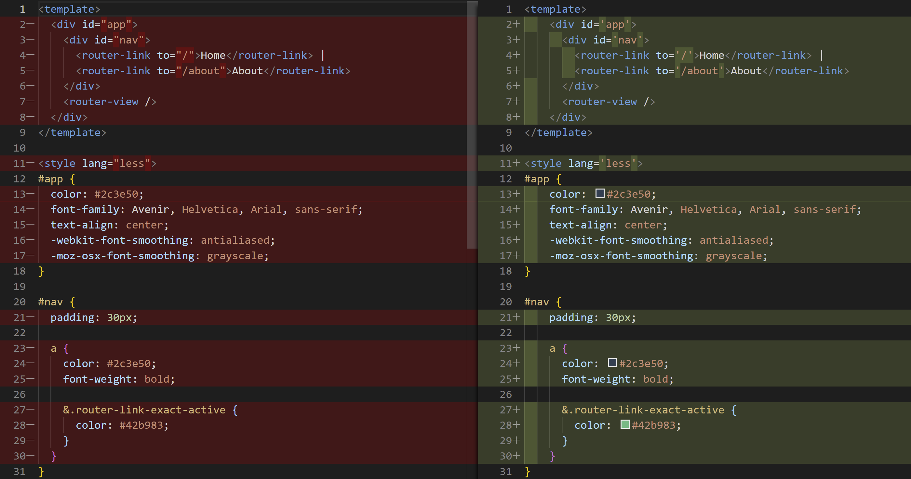
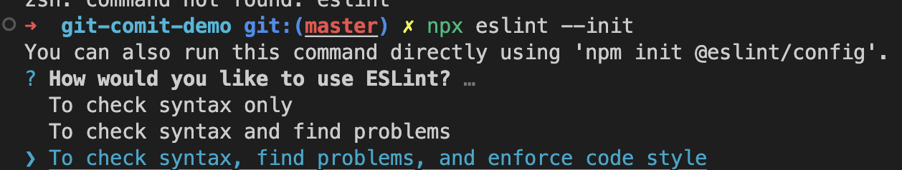
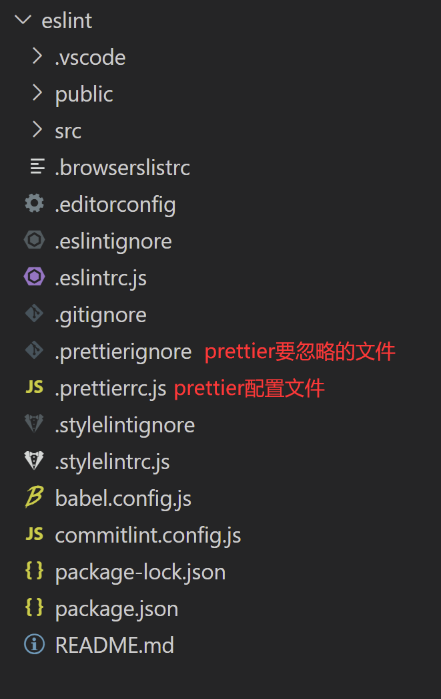
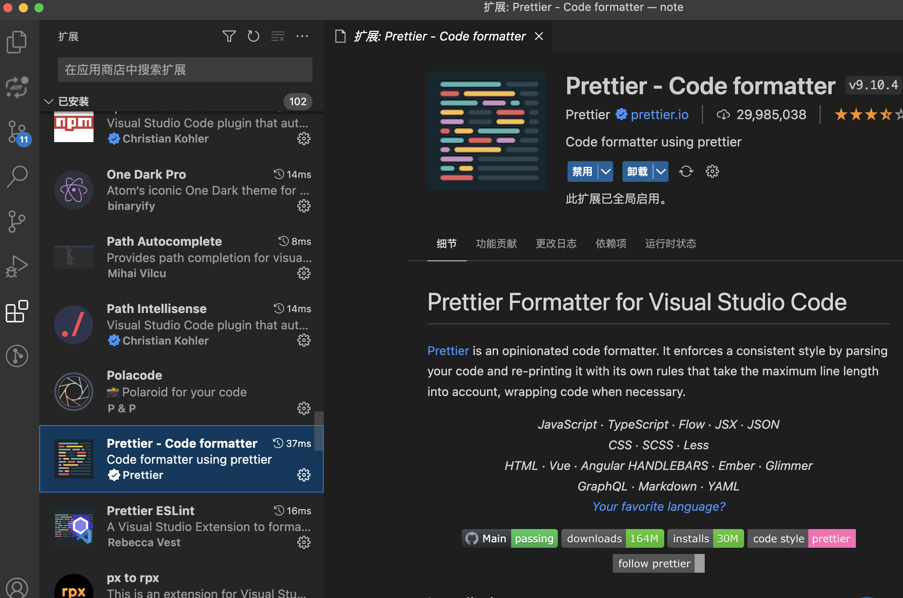
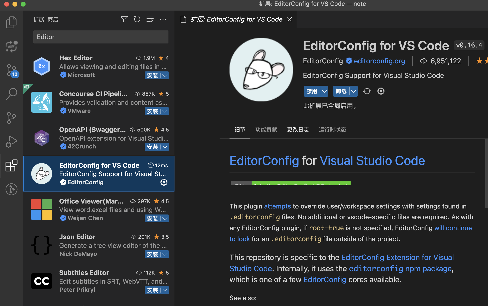
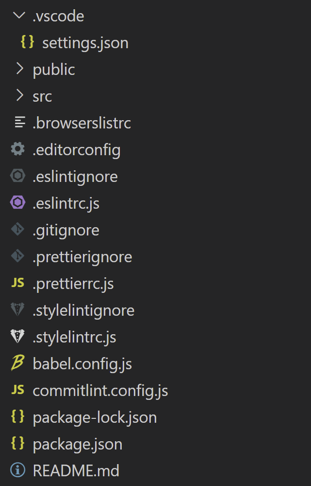
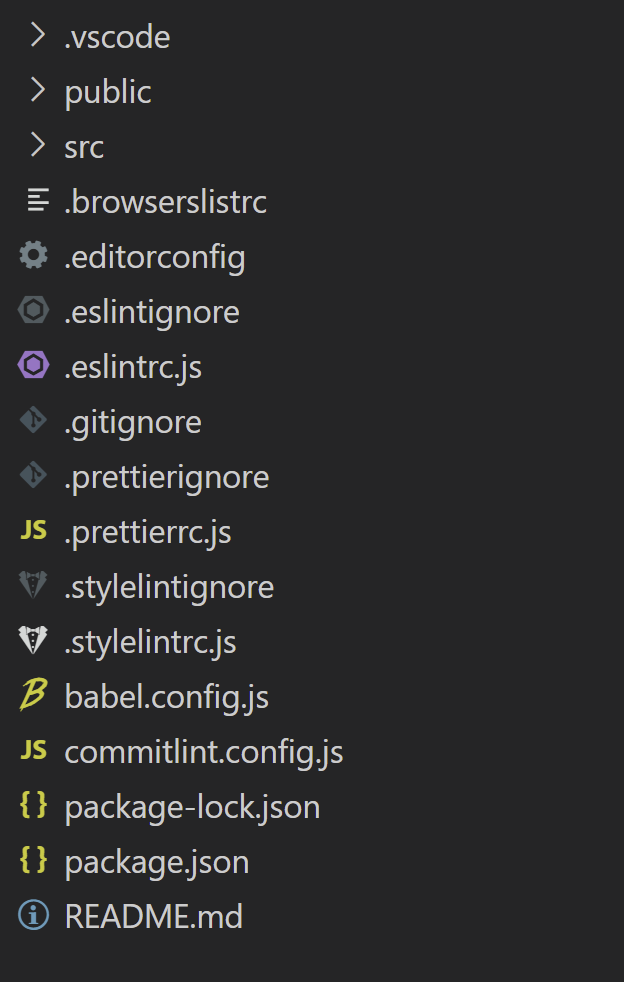

# ESLint 和 Prettier

代码规范是软件开发领域经久不衰的话题，几乎所有工程师在开发过程中都会遇到或思考过这一问题。而随着前端应用的大型化和复杂化，越来越多的前端团队也开始重视代码规范。

## 1. 统一代码风格的重要性

### **1.1 为什么要统一代码风格**

团队千千万，团队中每个人的代码风格也是千千万。比如有的同学写代码就喜欢用双引号，缩进用两个字符，而其他同学却可能更喜欢用单引号，四个字符缩进。而团队中的人一多，一往代码仓库提交代码，难免会出现下面这些情况：

**（1）如果没有统一代码风格，diff 时可能会出现很多因为格式不同的问题，不便于我们查看提交代码所做的修改**

如下图所示，提交的文件内容其实没有变化，只是代码风格变了（双引号变成了单引号，缩进从两个字符变成了四个字符），但是 diff 时大段代码会标红，不利于我们查看提交的修改。



**（2）每个团队都有自己的标准，新人加入需要花较长时间才能熟悉团队所使用的代码风格，不利于效率的提**

### 1.2 如何统一代码风格

为了统一代码风格，并且克服每个团队自己制定标准所带来的不足，一种简单方便的方法就是采用业界提供的标准和工具，也就是我们经常所说的**Lint 检查工具。前端中常用的 Lint 检查工具包括了 JSLint、ESLint 和 Stylelint 等，这些工具能够提供代码质量和代码风格检查的功能，并且可以根据个人/团队的代码风格进行对配置文件进行配置，有效的提高了我们代码开发的效率和质量**。

下面主要列举了现在主要采用的一些 Lint 检查工具，以及相关的 VSCode 辅助插件，帮助我们完成 JS 代码规范、CSS 代码规范和 Git 工作流规范的检查。

## 2. ESLint

[官网](https://zh-hans.eslint.org/)

### 2.1 什么是 ESLint

`ESLint` 是一款插件化的 JavaScript 代码静态检查工具，其核心是通过对代码解析得到的 AST（Abstract Syntax Tree，抽象语法树）进行模式匹配，来分析代码达到检查代码质量和风格问题的能力。

`ESLint` 的使用其实并不复杂。安装相关依赖之后，可以直接使用开源的配置方案，例如`eslint-config-airbnb`或 eslint-config-standard，当然，你也可以根据个人或团队的代码风格进行配置。配置完成之后，就可以通过命令行工具或借助编辑器集成的 ESLint 功能对工程代码进行静态检查，发现和修复不符合规范的代码，`ESLint`提供的`auto-fix`能力也能够帮助我们自动修复一些代码格式问题。

### 2.2 安装 ESLint

#### **（1）脚手架自动安装**

如果是采用脚手架如`Vue-Cli`创建项目，在创建项目时就可以选择安装`ESLint`，安装完成后，会自动在项目根目录生成一个`.eslintrc.js`文件，里面已经生成了`ESLint`的初始化默认配置。

#### **（2）手动安装**

如果是已经存在一个项目，并且想要安装`ESLint`，可以通过`npm`的方式进行安装

```bash
npm install eslint --save-dev
```

```bash
npx eslint --init
// or
npm init @eslint/config
```

经过一系列一问一答的环节后，你会发现在你项目根目录已经生成了一个 `.eslintrc.js`文件，该文件主要用来进行 ESLint 的配置。



### 2.3 ESLint 配置方式

`ESlint` 被设计为完全可配置的，我们可以混合和匹配 ESLint 默认绑定的规则和自己定义的规则，根据实际需求对每一个规则进行开启或关闭，以让 `ESLint` 更适合我们的项目。一般有两种主要的方式来配置 ESLint：

#### **（1）Configuration Comments - 使用注释把 lint 规则嵌入到源码中**

这种配置方式允许我们使用`JavaScript`注释把配置信息直接嵌入到一个代码源文件中，如下面的代码所示，可以直接在代码中使用`ESLint`能够识别的注释方式，进行 Lint 规则的定义，下面的规则表示如果使用`console`语法便会报错。

```js
/* eslint no-console: "error" */
console.log('this is an eslint rule check!')
```

当我们用命令行执行`eslint xxx.js`检查上述文件时，就会发现`eslint`给出报错信息。

#### **（2）Configuration Files - 使用配置文件进行 lint 规则配置**

除了上面的配置方式，另外一个更好的方式就是在项目根目录创建配置文件进行`ESLint`的配置，目前配置文件主要支持以下三种文件类型：

- JavaScript（eslintrc.js）
- YAML（eslintrc.yaml）
- JSON（eslintrc.json）

  另外，我们也可以在`package.json`文件中添加 `eslintConfig`字段进行配置。

  在我们团队平时的开发中，一般采用了在根目录创建`.eslintrc.js`的方式对`eslint`进行配置。如下图所示，给出了使用`Vue-Cli`创建项目后`.eslintrc.js`中的默认配置。

```js
module.exports = {
  root: true,
  env: {
    node: true,
  },
  extends: ['plugin:vue/essential', 'eslint:recommended', '@vue/prettier'],
  parserOptions: {
    parser: 'babel-eslint',
  },
  rules: {
    'no-console': process.env.NODE_ENV === 'production' ? 'warn' : 'off',
    'no-debugger': process.env.NODE_ENV === 'production' ? 'warn' : 'off',
  },
}
```

### 2.4 ESLint 配置项解析

接下来主要对 ESLint 配置文件中的配置项进行介绍。

#### **（1）parser 解析器**

ESLint 默认使用 Espreer 作为其解析器，但是该解析器仅支持最新的 ECMPScript(es5)标准，对于实验性的语法和非标准（例如 Flow 或 TypeScript 类型）语法是不支持的。因此，开源社区提供了以下两种解析器来丰富相关的功能：

babel-eslint：Babel 一个工具链，主要用于将 ECMAScript 2015+(es6+) 版本的代码转换为向后兼容的 JavaScript 语法，以便能够运行在当前和旧版本的浏览器或其他环境中。因此，如果在项目中使用 es6，就需要将解析器改成 babel-eslint。

@typescript-eslint/parser：该解析器将 TypeScript 转换成与 estree 兼容的形式， 允许 ESLint 验证 TypeScript 源代码。

#### **（2）parserOptions 解析器选项**

除了可以自定义解析器外，ESLint 允许指定你想要支持的 JavaScript 语言选项。默认情况下，ESLint 支持 ECMPScript 5 语法。你可以覆盖该设置，以启用对 ECMPScript 其它版本和 JSX 的支持。

#### **（3）env 和 global - 环境和全局变量**

ESLint 会检测未声明的变量，并发出警告，但是有些变量是我们引入的库声明的，这里就需要提前在配置中声明。每个变量有三个选项，writable，readonly 和 off，分别表示可重写，不可重写和禁用。

```js
{
  "globals": {
    // 声明 jQuery 对象为全局变量
    "$": false, // true表示该变量为 writeable，而 false 表示 readonly
    "jQuery": false
  }
}
```

在 globals 中一个个的进行声明未免有点繁琐，这个时候就需要使用到 env，这是对一个环境定义的一组全局变量的预设。当然，我们可以在 golbals 中使用字符串 off 禁用全局变量来覆盖 env 中的声明。

```js
{
  "env": {
    "browser": true,
    "es2021": true,
    "jquery": true // 环境中开启jquery，表示声明了jquery相关的全局变量，无需在globals二次声明
  }
}
```

如果是微信小程序开发，env 并没有定义微信小程序变量，需要在 globals 中手动声明全局变量，否则在文件中引入变量，会提示报错。声明如下所示：

```js
{
  globals: {
    wx: true,
    App: true,
    Page: true,
    Component: true,
    getApp: true,
    getCurrentPages: true,
    Behavior: true,
    global: true,
    __wxConfig: true,
  },
}
```

#### **（4）rules 规则**

ESLint 附带有[大量的规则](https://cn.eslint.org/docs/rules/)，你可以在配置文件的 rules 属性中配置你想要的规则。要改变一个规则设置，你必须将规则 ID 设置为下列值之一：

- off 或 0：关闭规则
- warn 或 1：开启规则，warn 级别的错误 (不会导致程序退出)
- error 或 2：开启规则，error 级别的错误(当被触发的时候，程序会退出)

  如以下代码，在 rules 中设置关闭某些规则

```js
rules: {
  'no-loop-func': 'off',
  'no-param-reassign': 'off',
  'no-nested-ternary': 'off',
   no-underscore-dangle': 'off',
},
```

**常用 rule 解释**

```js
"no-alert": 0,//禁止使用alert confirm prompt
"no-array-constructor": 2,//禁止使用数组构造器
"no-bitwise": 0,//禁止使用按位运算符
"no-caller": 1,//禁止使用arguments.caller或arguments.callee
"no-catch-shadow": 2,//禁止catch子句参数与外部作用域变量同名
"no-class-assign": 2,//禁止给类赋值
"no-cond-assign": 2,//禁止在条件表达式中使用赋值语句
"no-console": 2,//禁止使用console
"no-const-assign": 2,//禁止修改const声明的变量
"no-constant-condition": 2,//禁止在条件中使用常量表达式 if(true) if(1)
"no-continue": 0,//禁止使用continue
"no-control-regex": 2,//禁止在正则表达式中使用控制字符
"no-debugger": 2,//禁止使用debugger
"no-delete-var": 2,//不能对var声明的变量使用delete操作符
"no-div-regex": 1,//不能使用看起来像除法的正则表达式/=foo/
"no-dupe-keys": 2,//在创建对象字面量时不允许键重复 {a:1,a:1}
"no-dupe-args": 2,//函数参数不能重复
"no-duplicate-case": 2,//switch中的case标签不能重复
"no-else-return": 2,//如果if语句里面有return,后面不能跟else语句
"no-empty": 2,//块语句中的内容不能为空
"no-empty-character-class": 2,//正则表达式中的[]内容不能为空
"no-empty-label": 2,//禁止使用空label
"no-eq-null": 2,//禁止对null使用==或!=运算符
"no-eval": 1,//禁止使用eval
"no-ex-assign": 2,//禁止给catch语句中的异常参数赋值
"no-extend-native": 2,//禁止扩展native对象
"no-extra-bind": 2,//禁止不必要的函数绑定
"no-extra-boolean-cast": 2,//禁止不必要的bool转换
"no-extra-parens": 2,//禁止非必要的括号
"no-extra-semi": 2,//禁止多余的冒号
"no-fallthrough": 1,//禁止switch穿透
"no-floating-decimal": 2,//禁止省略浮点数中的0 .5 3.
"no-func-assign": 2,//禁止重复的函数声明
"no-implicit-coercion": 1,//禁止隐式转换
"no-implied-eval": 2,//禁止使用隐式eval
"no-inline-comments": 0,//禁止行内备注
"no-inner-declarations": [2, "functions"],//禁止在块语句中使用声明（变量或函数）
"no-invalid-regexp": 2,//禁止无效的正则表达式
"no-invalid-this": 2,//禁止无效的this，只能用在构造器，类，对象字面量
"no-irregular-whitespace": 2,//不能有不规则的空格
"no-iterator": 2,//禁止使用__iterator__ 属性
"no-label-var": 2,//label名不能与var声明的变量名相同
"no-labels": 2,//禁止标签声明
"no-lone-blocks": 2,//禁止不必要的嵌套块
"no-lonely-if": 2,//禁止else语句内只有if语句
"no-loop-func": 1,//禁止在循环中使用函数（如果没有引用外部变量不形成闭包就可以）
"no-mixed-requires": [0, false],//声明时不能混用声明类型
"no-mixed-spaces-and-tabs": [2, false],//禁止混用tab和空格
"linebreak-style": [0, "windows"],//换行风格
"no-multi-spaces": 0,//不能用多余的空格
"no-multi-str": 2,//字符串不能用\换行
"no-multiple-empty-lines": [1, {"max": 3}],//空行最多不能超过2行
"no-native-reassign": 2,//不能重写native对象
"no-negated-in-lhs": 2,//in 操作符的左边不能有!
"no-nested-ternary": 0,//禁止使用嵌套的三目运算
"no-new": 1,//禁止在使用new构造一个实例后不赋值
"no-new-func": 1,//禁止使用new Function
"no-new-object": 2,//禁止使用new Object()
"no-new-require": 2,//禁止使用new require
"no-new-wrappers": 2,//禁止使用new创建包装实例，new String new Boolean new Number
"no-obj-calls": 2,//不能调用内置的全局对象，比如Math() JSON()
"no-octal": 2,//禁止使用八进制数字
"no-octal-escape": 2,//禁止使用八进制转义序列
"no-param-reassign": 2,//禁止给参数重新赋值
"no-path-concat": 0,//node中不能使用__dirname或__filename做路径拼接
"no-plusplus": 0,//禁止使用++，--
"no-process-env": 0,//禁止使用process.env
"no-process-exit": 0,//禁止使用process.exit()
"no-proto": 2,//禁止使用__proto__属性
"no-redeclare": 2,//禁止重复声明变量
"no-regex-spaces": 2,//禁止在正则表达式字面量中使用多个空格 /foo bar/
"no-restricted-modules": 0,//如果禁用了指定模块，使用就会报错
"no-return-assign": 1,//return 语句中不能有赋值表达式
"no-script-url": 0,//禁止使用javascript:void(0)
"no-self-compare": 2,//不能比较自身
"no-sequences": 0,//禁止使用逗号运算符
"no-shadow": 2,//外部作用域中的变量不能与它所包含的作用域中的变量或参数同名
"no-shadow-restricted-names": 2,//严格模式中规定的限制标识符不能作为声明时的变量名使用
"no-spaced-func": 2,//函数调用时 函数名与()之间不能有空格
"no-sparse-arrays": 2,//禁止稀疏数组， [1,,2]
"no-sync": 0,//nodejs 禁止同步方法
"no-ternary": 0,//禁止使用三目运算符
"no-trailing-spaces": 1,//一行结束后面不要有空格
"no-this-before-super": 0,//在调用super()之前不能使用this或super
"no-throw-literal": 2,//禁止抛出字面量错误 throw "error";
"no-undef": 2,//不能有未定义的变量
"no-undef-init": 2,//变量初始化时不能直接给它赋值为undefined
"no-undefined": 2,//不能使用undefined
"no-unexpected-multiline": 2,//避免多行表达式
"no-underscore-dangle": 1,//标识符不能以_开头或结尾
"no-unneeded-ternary": 2,//禁止不必要的嵌套 var isYes = answer === 1 ? true : false;
"no-unreachable": 2,//不能有无法执行的代码
"no-unused-expressions": 2,//禁止无用的表达式
"no-unused-vars": [2, {"vars": "all", "args": "after-used"}],//不能有声明后未被使用的变量或参数
"no-use-before-define": 2,//未定义前不能使用
"no-useless-call": 2,//禁止不必要的call和apply
"no-void": 2,//禁用void操作符
"no-var": 0,//禁用var，用let和const代替
"no-warning-comments": [1, { "terms": ["todo", "fixme", "xxx"], "location": "start" }],//不能有警告备注
"no-with": 2,//禁用with

"array-bracket-spacing": [2, "never"],//是否允许非空数组里面有多余的空格
"arrow-parens": 0,//箭头函数用小括号括起来
"arrow-spacing": 0,//=>的前/后括号
"accessor-pairs": 0,//在对象中使用getter/setter
"block-scoped-var": 0,//块语句中使用var
"brace-style": [1, "1tbs"],//大括号风格
"callback-return": 1,//避免多次调用回调什么的
"camelcase": 2,//强制驼峰法命名
"comma-dangle": [2, "never"],//对象字面量项尾不能有逗号
"comma-spacing": 0,//逗号前后的空格
"comma-style": [2, "last"],//逗号风格，换行时在行首还是行尾
"complexity": [0, 11],//循环复杂度
"computed-property-spacing": [0, "never"],//是否允许计算后的键名什么的
"consistent-return": 0,//return 后面是否允许省略
"consistent-this": [2, "that"],//this别名
"constructor-super": 0,//非派生类不能调用super，派生类必须调用super
"curly": [2, "all"],//必须使用 if(){} 中的{}
"default-case": 2,//switch语句最后必须有default
"dot-location": 0,//对象访问符的位置，换行的时候在行首还是行尾
"dot-notation": [0, { "allowKeywords": true }],//避免不必要的方括号
"eol-last": 0,//文件以单一的换行符结束
"eqeqeq": 0,//必须使用全等
"func-names": 0,//函数表达式必须有名字
"func-style": [0, "declaration"],//函数风格，规定只能使用函数声明/函数表达式
"generator-star-spacing": 0,//生成器函数*的前后空格
"guard-for-in": 0,//for in循环要用if语句过滤
"handle-callback-err": 0,//nodejs 处理错误
"id-length": 0,//变量名长度
"indent": [2, 2],//缩进风格
"init-declarations": 0,//声明时必须赋初值
"key-spacing": [0, { "beforeColon": false, "afterColon": true }],//对象字面量中冒号的前后空格
"lines-around-comment": 0,//行前/行后备注
"max-depth": [0, 4],//嵌套块深度
"max-len": [0, 80, 4],//字符串最大长度
"max-nested-callbacks": [0, 2],//回调嵌套深度
"max-params": [0, 3],//函数最多只能有3个参数
"max-statements": [0, 10],//函数内最多有几个声明
"new-cap": 2,//函数名首行大写必须使用new方式调用，首行小写必须用不带new方式调用
"new-parens": 2,//new时必须加小括号
"newline-after-var": 2,//变量声明后是否需要空一行
"object-curly-spacing": [0, "never"],//大括号内是否允许不必要的空格
"object-shorthand": 0,//强制对象字面量缩写语法
"one-var": 1,//连续声明
"operator-assignment": [0, "always"],//赋值运算符 += -=什么的
"operator-linebreak": [2, "after"],//换行时运算符在行尾还是行首
"padded-blocks": 0,//块语句内行首行尾是否要空行
"prefer-const": 0,//首选const
"prefer-spread": 0,//首选展开运算
"prefer-reflect": 0,//首选Reflect的方法
"quotes": [1, "single"],//引号类型 `` "" ''
"quote-props":[2, "always"],//对象字面量中的属性名是否强制双引号
"radix": 2,//parseInt必须指定第二个参数
"id-match": 0,//命名检测
"require-yield": 0,//生成器函数必须有yield
"semi": [2, "always"],//语句强制分号结尾
"semi-spacing": [0, {"before": false, "after": true}],//分号前后空格
"sort-vars": 0,//变量声明时排序
"space-after-keywords": [0, "always"],//关键字后面是否要空一格
"space-before-blocks": [0, "always"],//不以新行开始的块{前面要不要有空格
"space-before-function-paren": [0, "always"],//函数定义时括号前面要不要有空格
"space-in-parens": [0, "never"],//小括号里面要不要有空格
"space-infix-ops": 0,//中缀操作符周围要不要有空格
"space-return-throw-case": 2,//return throw case后面要不要加空格
"space-unary-ops": [0, { "words": true, "nonwords": false }],//一元运算符的前/后要不要加空格
"spaced-comment": 0,//注释风格要不要有空格什么的
"strict": 2,//使用严格模式
"use-isnan": 2,//禁止比较时使用NaN，只能用isNaN()
"valid-jsdoc": 0,//jsdoc规则
"valid-typeof": 2,//必须使用合法的typeof的值
"vars-on-top": 2,//var必须放在作用域顶部
"wrap-iife": [2, "inside"],//立即执行函数表达式的小括号风格
"wrap-regex": 0,//正则表达式字面量用小括号包起来
"yoda": [2, "never"]//禁止尤达条件
```

#### **（5）plugins 插件**

虽然官方提供了上百种的规则可供选择，但是这还不够，因为官方的规则只能检查标准的 JavaScript 语法，如果你写的是 JSX 或者 TypeScript，ESLint 的规则就开始束手无策了。

这个时候就需要安装 ESLint 的插件，来定制一些特定的规则进行检查。ESLint 的插件与扩展一样有固定的命名格式，以 eslint-plugin-开头，使用的时候也可以省略这个头。

举个例子，我们要在项目中使用 TypeScript，前面提到过，需要将解析器改为@typescript-eslint/parser，同时需要安装@typescript-eslint/eslint-plugin 插件来拓展规则，添加的 plugins 中的规则默认是不开启的，我们需要在 rules 中选择我们要使用的规则。也就是说 plugins 是要和 rules 结合使用的。如下所示：

```js
// npm i --save-dev @typescript-eslint/eslint-plugin    // 注册插件
{
  "parser": "@typescript-eslint/parser",
  "plugins": ["@typescript-eslint"],   // 引入插件
  "rules": {
    "@typescript-eslint/rule-name": "error"    // 使用插件规则
    '@typescript-eslint/adjacent-overload-signatures': 'error',
    '@typescript-eslint/ban-ts-comment': 'error',
    '@typescript-eslint/ban-types': 'error',
    '@typescript-eslint/explicit-module-boundary-types': 'warn',
    '@typescript-eslint/no-array-constructor': 'error',
    'no-empty-function': 'off',
    '@typescript-eslint/no-empty-function': 'error',
    '@typescript-eslint/no-empty-interface': 'error',
    '@typescript-eslint/no-explicit-any': 'warn',
    '@typescript-eslint/no-extra-non-null-assertion': 'error',
    ...
  }
}
```

#### **（6）extends 扩展**

extends 可以理解为一份配置好的 plugin 和 rules，extends 属性值一般包括以下两种：

- 指定配置的字符串: 比如官方提供的两个拓展[eslint:recommended](https://github.com/eslint/eslint/blob/v6.0.1/conf/eslint-recommended.js)或[eslint:all](https://github.com/yannickcr/eslint-plugin-react/blob/master/index.js#L108)，可以启用当前安装的 ESLint 中所有的核心规则，省得我们在 rules 中一一配置。
- 字符串数组：每个配置继承它前面的配置。如下所示，拓展是一个数组，ESLint 递归地扩展配置, 然后使用 rules 属性来拓展或者覆盖 extends 配置规则。

```js
{
    "extends": [
        "eslint:recommended", // 官方拓展
        "plugin:@typescript-eslint/recommended", // 插件拓展
        "standard", // npm包，开源社区流行的配置方案，比如：eslint-config-airbnb、eslint-config-standard
    ],
    "rules": {
     "indent": ["error", 4], // 拓展或覆盖extends配置的规则
        "no-console": "off",
    }
};
```

### 2.5 运行 ESLint 检查文件

当我们配置好.eslintrc.js 文件后，我们就可以通过运行 ESLint 相关命令，对指定文件进行检查

当我们想对某个文件进行检查时，只需要在当前目录打开命令行窗口，输入以下命令，就可以对某个文件或某个目录下的所有文件进行检查。如果执行完命令后什么也没有输出，就说明我们的代码已经通过 ESLint 检查，可以放心提交代码。

然后在 package.json 中添加脚本：

```json
{
  "scripts": {
    "lint": "eslint --fix \"./src/**/*.{ts,js,vue,tsx}\""
  }
}
```

```bash
eslint src/APP.vue　　// 检查指定的文件
eslint src/*.vue　　  // 检查src目录下的所有文件
```

但是如果出现提示或报错，就说明我们的代码没有通过 ESLint 的检查，需要按照提示进行修改。

我们可以执行以下的 ESLint 自动修复命令，对一些错误进行自动修复。不过，这个命令只能自动修复一些代码格式上的错误（比如 ESLint 的配置要求需要使用双引号，但是写代码时采用了单引号而报错），对于一些语法错误，就需要我们手动去修复。

```bash
eslint src/APP.vue --fix   // 检查指定的文件，并且自动修复错误
eslint src/*.vue --fix     // 检查src目录下的所有文件，并且自动修复错误
```

### 2.6 跳过 ESLint 的检查

在实际的使用场景中，我们可能存在某些文件或某行代码，希望能够跳过 `ESLint` 的检查，下面主要介绍了几种跳过 `ESLint` 检查的方式：

#### **（1）使用注释跳过 ESLint 的检查**

- 块注释： 使用如下方式，可以在整个文件或者代码块禁用所有规则或者禁用特定规则：

```js
/* eslint-disable */
alert('该注释放在文件顶部，整个文件都不会出现 lint 警告')

/* eslint-disable */
alert('块注释 - 禁用所有规则')
/* eslint-enable */

/* eslint-disable no-console, no-alert */
alert('块注释 - 禁用 no-console, no-alert 特定规则')
/* eslint-enable no-console, no-alert */
```

- 行注释： 使用如下方式可以在某一特定的行上禁用所有规则或者禁用特定规则：

```js
alert('禁用该行所有规则') // eslint-disable-line

// eslint-disable-next-line
alert('禁用该行所有规则')

/* eslint-disable-next-line no-alert */
alert('禁用该行 no-alert 特定规则')

alert('禁用该行 no-alert, quotes, semi 特定规则') /* eslint-disable-line no-alert, quotes, semi*/
```

#### （**2）创建.eslintignore 文件忽略某些文件的检查**

在项目根目录创建`.eslintignore` 文件，在该文件中添加需要跳过检查的文件名称，ESLint 将会跳过这些文件的检查。如下所示，`ESLint` 将会跳过 `dist`、`node_modules` 和 `package.json` 文件的检查。

```bash
dist
node_modules
package.json
```

## 3. Prettier

[官网](https://www.prettier.cn/)

### 3.1 什么是 Prettier

Prettier 是一个**代码格式化工具，可以格式化代码，但不具备代码检查功能**，它可以通过解析代码并使用自己的规则重新打印它，并考虑最大行长来强制一致的样式，并在必要时包装代码，如今，它已成为解决所有代码格式问题的优选方案，支持多种语言，可以将 `ESLint` 和 `Prettier` 结合使用，提高代码质量。

### 3.2 为什么要用 Prettier

上面 `Prettier` 的定义一看，是不是觉得和 `ESLint` 差不了多少？那么，有了 `ESLint`，为什么还要用 `Prettier` 呢？

其实，`ESLint` 虽然是一个代码检测工具，可以检测代码质量问题并给出提示，但是提供的格式化功能有限，在代码风格上面做的不是很好，并且也只能格式化 `JS`，不支持 `CSS`,`HTML` 等语言。而在代码风格上面，`Prettier` 具有更加强大的功能，并且能够支持包括 `JavaScript`、`TypeScript`、各种 `CSS`、`Vue` 和 `Markdown` 等前端绝大部分的语言和文件格式。因此，我们一般会将 `ESLint` 和 `Prettier` 一起结合起来使用，用 `ESLint` 进行代码校验，用 `Prettier` 统一代码风格。

### 3.3 安装 Prettier

#### **（1）脚手架自动安装**

如果是采用脚手架如 `Vue-Cli` 创建项目，在创建项目时就可以选择安装 `Prettier`，安装完成后，会自动在项目根目录生成一个`.prettierc.js` 文件，里面的默认配置中已经包含了 `prettier` 的相关扩展。

#### **（2）手动安装**

如果已经存在一个项目，并且想要安装 `Prettier`，可以通过 `npm` 的方式进行安装。

```bash
npm install prettier --save-dev
```

### 3.4 安装 eslint-config-prettier

安装好 `Prettier` 之后，我们还需要安装 `eslint-config-prettier`，这是因为 `eslint` 和 `prettier` 里面的一些规则可能会存在冲突，这个时候我们就需要安装 `eslint-config-prettier`，并且关掉所有和 `prettier` 冲突的 `eslint` 配置。

通过 npm 安装 `eslint-config-prettier`。

```bash
npm install eslint-config-prettier --save-dev
```

安装好 `eslint-config-prettier` 之后，接下来我们就需要关掉所有和 `prettier` 冲突的 `eslint` 配置。这里只需要在`.eslintrc.js` 的 `extends` 中将 `prettier` 设置为最后一个 `extends` 即可，相当于用 `prettier` 的规则，覆盖掉 `eslint:recommended` 的部分规则。

```js
extends: ["eslint:recommended", "prettier"],
```

### 3.5 安装 eslint-plugin-prettier

接下来，我们还需要安装 `eslint-plugin-prettier`，`eslint-plugin-prettier` 的作用时是将 `prettier` 的能力集成到 `eslint` 中，使得我们在运行 `eslint` 检查我们的代码时，能够按照 prettier 的规则检查代码规范性，并进行修复。

使用 npm 安装 `eslint-plugin-prettier`。

```bash
npm install eslint-plugin-prettier
```

安装 `eslint-plugin-prettier` 后，需要对`.eslintrc.js` 进行配置。

```js
{
    rules:{
      "prettier/prettier":"error"
    },
    plugins: ["prettier"]，
}
```

除了上面这种配置之外，我们也可以直接将上面两个步骤结合在一起，使用下面的配置就可以。

```js
{
 "extends": [
     "eslint:recommended",
     "plugin:prettier/recommended"
 ]
}
```

### 3.6 配置文件

`Prettier` 和 `ESLint` 一样，支持我们通过配置文件的方式，实现自定义配置，覆盖原来的 `Prettier` 配置。

我们可以在根目录创建`.prettierrc` 文件，`.prettierrc` 文件支持写入 `YAML`，`JSON` 的配置格式，并且支持.yaml，.yml，.json 和.js 后缀。在平时的开发中，我们团队一般会选择创建`.prettierrc.js` 文件，实现对 `prettier` 配置的覆盖。



在`.prettierrc.js` 文件中，我们可以对 `prettier` 的默认配置进行修改。

```js
module.exports = {
  // 一行最多 120 字符
  printWidth: 120,
  // 使用 2 个空格缩进
  tabWidth: 2,
  // 不使用缩进符，而使用空格
  useTabs: false,
  // 行尾需要有分号
  semi: false,
  // 使用单引号
  singleQuote: true,
  // 对象的 key 仅在必要时用引号
  quoteProps: 'as-needed',
  // jsx 不使用单引号，而使用双引号
  jsxSingleQuote: false,
  // 末尾需要有逗号
  trailingComma: 'all',
  // 大括号内的首尾需要空格
  bracketSpacing: true,
  // jsx 标签的反尖括号需要换行
  jsxBracketSameLine: false,
  // 箭头函数，只有一个参数的时候，也需要括号
  arrowParens: 'always',
  // 每个文件格式化的范围是文件的全部内容
  rangeStart: 0,
  rangeEnd: null,
  // 不需要写文件开头的 @prettier
  requirePragma: false,
  // 不需要自动在文件开头插入 @prettier
  insertPragma: false,
  // 使用默认的折行标准
  proseWrap: 'preserve',
  // 根据显示样式决定 html 要不要折行
  htmlWhitespaceSensitivity: 'css',
  // vue 文件中的 script 和 style 内不用缩进
  vueIndentScriptAndStyle: false,
  // 换行符使用 lf
  endOfLine: 'lf',
  // 格式化内嵌代码
  embeddedLanguageFormatting: 'auto',
}
```

### 3.7 忽略某些文件的格式化

Prettier 和 ESLint 一样，也支持忽略对某些文件的格式化。如果我们存在一些不需要格式化的文件，可以在根目录创建.prettierignore 文件，并且将不需要格式化的文件或目录名称写在该文件中。

```bash
dist
node_modules
.eslintignore
.prettierignore
```

## 4. VSCode 插件

### 4.1 安装 VSCode 插件

配置好 ESLint 和 Prettier 之后，我们通过运行 eslint 命令，就可以对我们代码进行检查啦。但是，每次要手动运行命令才能检查我们的代码还是有点麻烦，有没有更简单的方式，让我们在编写代码的过程中，只要保存文件就能够对当前文件进行检查，并且自动修复一些错误呢？接下来，接下来，VSCode 插件就登场啦~

首先，我们需要安装的 ESLint 插件，安装方法很简单，在 VSCode 的 EXTENSIONS 中找到 ESLint 插件，然后点击 install 就可以啦。


接着，我们还需要安装 Prettier 插件。



最后，我们也把 EditorConfig for VS Code 插件安装上，这个插件可以让编译器读取配置文件，并且按照配置文件里面的规定来格式化代码，有了这个插件，只要定义好一份配置文件，就算团队成员用的编译器不同，也能够输出风格统一的代码。



### 4.2 配置 settings.json 文件

安装好插件之后，我们还需要设置 VSCode 的 settings.json 文件，实现保存代码时就自动执行 ESLint 检查。VSCode 的 setting.json 设置分为工作区和用户两个级别，其中用户区会对所有项目生效，而工作区的设置只会对当前项目生效。

**（1）用户区 settings.json 配置**

点击 VSCode 左下角的设置按钮，选择 Settings，选择以文本编辑形式打开 settings.json，并且在 setting.json 中加入以下代码。配置完成之后，当我们保存某个文件时，就可以自动对当前文件进行 ESLint 检查，并且自动对一些错误进行修复啦。

```json
{
  // #每次保存的时候自动格式化
  "editor.formatOnSave": true,
  "editor.codeActionsOnSave": {
    "source.fixAll.eslint": true
  }
}
```

**（2）工作区 settings.json 配置**

除了配置用户区的 settings.json 之外，我们也可以配置工作区的 settings.json，工作区的配置只会对当前项目生效。

首先，我们需要在项目根目录创建.vscode 目录，并且在该目录下创建 settings.json 文件。



接着，在 settings.json 中加入以下代码，配置完成后，当我们保存该项目中某个文件时，也会自动对该文件进行 ESLint 检查，并且自动修复一些问题。

```json
{
  "editor.tabSize": 2,
  "editor.formatOnSave": true,
  "editor.defaultFormatter": "esbenp.prettier-vscode",
  "editor.formatOnSave": true,
  "editor.codeActionsOnSave": {
    "source.fixAll.eslint": true
  },
  "eslint.validate": ["typescript", "javascript", "vue"],
  "[typescript]": {
    "editor.defaultFormatter": "esbenp.prettier-vscode"
  },
  "[typescriptreact]": {
    "editor.defaultFormatter": "esbenp.prettier-vscode"
  },
  "[javascriptreact]": {
    "editor.defaultFormatter": "esbenp.prettier-vscode"
  },
  "less.compile": {
    "compress": true, // 是否删除多余空白字符
    "sourceMap": false, // 是否创建文件目录树，true的话会自动生成一个 .css.map 文件
    "out": false // 是否编译输出文件
  }
}
```

### 4.3 配置 EditorConfig 文件

上面在安装 VSCode 插件时，我们提到了要安装 EditorConfig for VS Code 插件，那这个插件需要怎么起作用呢？

首先，我们需要在项目根目录创建.editorconfig 文件。创建完成之后，这个文件里面定义的代码规范规则会高于编译器默认的代码规范规则。



接着，我们只需要在.editorconfig 文件中加入我们想要覆盖的编译器的配置，比如下面的配置定义了缩进为 2 个空格，那么就算编译器默认的是 4 个空格的缩进，最后也会按照我们的.editorconfig 配置，按照 2 个空格进行缩进。

```bash
# http://editorconfig.org
root = true

[*]
charset = utf-8
end_of_line = lf
indent_style = space
indent_size = 4
insert_final_newline = true
trim_trailing_whitespace = true

[*.md]
max_line_length = 0
trim_trailing_whitespace = false

[COMMIT_EDITMSG]
max_line_length = 0

```

当我们完成上面的步骤之后，接下来我们只要编写代码，保存，就能够得到一份风格统一的代码

## 5.配置 pre-commit

通过上面的配置，不出意外的话，我们基本已经可以实现对老的代码和新的添加的代码实现了格式化的效果，然后就能愉快的提交代码了。

还有一个问题是，并不一定每个人都配置好了格式化的插件，这就没法保证所有人提交的代码都是格式化后的，所以我们还需要增加最后一道防线，在代码提交前验证一遍。这需要添加 git 的 pre-commit 钩子，添加钩子可以手动配置，也可以选择目前成熟的方案，这里我们使用 husky + lint-staged 方案

首先安装这两个包：

```bash
npm i -D husky lint-staged
```

husky 是提供 git 钩子的解决方案，它可以提供 git 在多个阶段前的操作，比如 pre-commit、pre-push 等，这里我们使用 pre-commit

lint-staged，它只对 git 暂存区的文件执行 linter 检测，相对每次执行 lint 命令，这种只对增量修改的检测效率会高很多

在 package.json 中添加如下脚本：

```json
{
  "husky": {
    "hooks": {
      "pre-commit": "lint-staged"
    }
  },
  "lint-staged": {
    "*.{js,jsx,tsx}": ["eslint --fix", "git add"]
  }
}
```

现在每次在提交的代码的时候，会默认执行`pre-commit`，然后执行 lint-staged 检测，在`lint-staged`脚本中先执行`eslint --fix`，如前所述，此时会使用`prettier`规则格式化文件，没有错误会执行`git add`把`fix`过后的文件添加到暂存区，否则会报错退出。

至此，我们就完成了在项目配置 eslint 和`prettier`的全部工作了。
