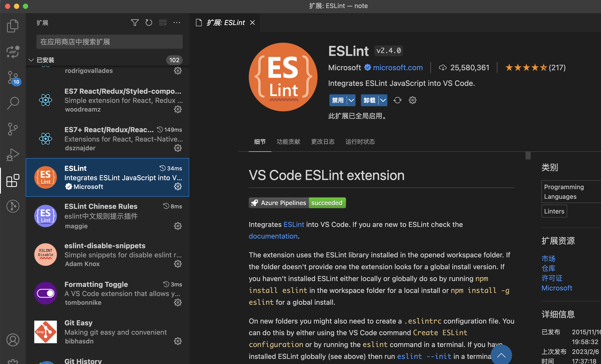

# ESLint 和 Prettier

代码规范是软件开发领域经久不衰的话题，几乎所有工程师在开发过程中都会遇到或思考过这一问题。而随着前端应用的大型化和复杂化，越来越多的前端团队也开始重视代码规范。

## 1. 统一代码风格的重要性

### **1.1 为什么要统一代码风格**

团队千千万，团队中每个人的代码风格也是千千万。比如有的同学写代码就喜欢用双引号，缩进用两个字符，而其他同学却可能更喜欢用单引号，四个字符缩进。而团队中的人一多，一往代码仓库提交代码，难免会出现下面这些情况：

**（1）如果没有统一代码风格，diff 时可能会出现很多因为格式不同的问题，不便于我们查看提交代码所做的修改**

如下图所示，提交的文件内容其实没有变化，只是代码风格变了（双引号变成了单引号，缩进从两个字符变成了四个字符），但是 diff 时大段代码会标红，不利于我们查看提交的修改。

[

**（2）每个团队都有自己的标准，新人加入需要花较长时间才能熟悉团队所使用的代码风格，不利于效率的提**

### 1.2 如何统一代码风格

为了统一代码风格，并且克服每个团队自己制定标准所带来的不足，一种简单方便的方法就是采用业界提供的标准和工具，也就是我们经常所说的**Lint 检查工具。前端中常用的 Lint 检查工具包括了 JSLint、ESLint 和 Stylelint 等，这些工具能够提供代码质量和代码风格检查的功能，并且可以根据个人/团队的代码风格进行对配置文件进行配置，有效的提高了我们代码开发的效率和质量**。

下面主要列举了现在主要采用的一些 Lint 检查工具，以及相关的 VSCode 辅助插件，帮助我们完成 JS 代码规范、CSS 代码规范和 Git 工作流规范的检查。

## 2. ESLint

[官网](https://zh-hans.eslint.org/)

### 2.1 什么是 ESLint

`ESLint` 是一款插件化的 JavaScript 代码静态检查工具，其核心是通过对代码解析得到的 AST（Abstract Syntax Tree，抽象语法树）进行模式匹配，来分析代码达到检查代码质量和风格问题的能力。

`ESLint` 的使用其实并不复杂。安装相关依赖之后，可以直接使用开源的配置方案，例如`eslint-config-airbnb`或 eslint-config-standard，当然，你也可以根据个人或团队的代码风格进行配置。配置完成之后，就可以通过命令行工具或借助编辑器集成的 ESLint 功能对工程代码进行静态检查，发现和修复不符合规范的代码，`ESLint`提供的`auto-fix`能力也能够帮助我们自动修复一些代码格式问题。

### 2.2 安装 ESLint

**（1）脚手架自动安装**

如果是采用脚手架如`Vue-Cli`创建项目，在创建项目时就可以选择安装`ESLint`，安装完成后，会自动在项目根目录生成一个`.eslintrc.js`文件，里面已经生成了`ESLint`的初始化默认配置。

**（2）手动安装**

如果是已经存在一个项目，并且想要安装`ESLint`，可以通过`npm`的方式进行安装

```bash
npm install eslint --save-dev
```

```bash
npx eslint --init
// or
npm init @eslint/config
```

经过一系列一问一答的环节后，你会发现在你项目根目录已经生成了一个 `.eslintrc.js`文件，该文件主要用来进行 ESLint 的配置。

[

### 2.3 ESLint 配置方式

`ESlint` 被设计为完全可配置的，我们可以混合和匹配 ESLint 默认绑定的规则和自己定义的规则，根据实际需求对每一个规则进行开启或关闭，以让 `ESLint` 更适合我们的项目。一般有两种主要的方式来配置 ESLint：

**（1）Configuration Comments - 使用注释把 lint 规则嵌入到源码中**

这种配置方式允许我们使用`JavaScript`注释把配置信息直接嵌入到一个代码源文件中，如下面的代码所示，可以直接在代码中使用`ESLint`能够识别的注释方式，进行 Lint 规则的定义，下面的规则表示如果使用`console`语法便会报错。

```js
/* eslint no-console: "error" */
console.log('this is an eslint rule check!')
```

当我们用命令行执行`eslint xxx.js`检查上述文件时，就会发现`eslint`给出报错信息。

**（2）Configuration Files - 使用配置文件进行 lint 规则配置**

除了上面的配置方式，另外一个更好的方式就是在项目根目录创建配置文件进行`ESLint`的配置，目前配置文件主要支持以下三种文件类型：

- JavaScript（eslintrc.js）
- YAML（eslintrc.yaml）
- JSON（eslintrc.json）

  另外，我们也可以在`package.json`文件中添加 `eslintConfig`字段进行配置。

  在我们团队平时的开发中，一般采用了在根目录创建`.eslintrc.js`的方式对`eslint`进行配置。如下图所示，给出了使用`Vue-Cli`创建项目后`.eslintrc.js`中的默认配置。

```js
module.exports = {
  root: true,
  env: {
    node: true,
  },
  extends: ['plugin:vue/essential', 'eslint:recommended', '@vue/prettier'],
  parserOptions: {
    parser: 'babel-eslint',
  },
  rules: {
    'no-console': process.env.NODE_ENV === 'production' ? 'warn' : 'off',
    'no-debugger': process.env.NODE_ENV === 'production' ? 'warn' : 'off',
  },
}
```

### 2.4 ESLint 配置项解析

接下来主要对 ESLint 配置文件中的配置项进行介绍。

**（1）parser 解析器**

ESLint 默认使用 Espreer 作为其解析器，但是该解析器仅支持最新的 ECMPScript(es5)标准，对于实验性的语法和非标准（例如 Flow 或 TypeScript 类型）语法是不支持的。因此，开源社区提供了以下两种解析器来丰富相关的功能：

babel-eslint：Babel 一个工具链，主要用于将 ECMAScript 2015+(es6+) 版本的代码转换为向后兼容的 JavaScript 语法，以便能够运行在当前和旧版本的浏览器或其他环境中。因此，如果在项目中使用 es6，就需要将解析器改成 babel-eslint。

@typescript-eslint/parser：该解析器将 TypeScript 转换成与 estree 兼容的形式， 允许 ESLint 验证 TypeScript 源代码。

**（2）parserOptions 解析器选项**

除了可以自定义解析器外，ESLint 允许指定你想要支持的 JavaScript 语言选项。默认情况下，ESLint 支持 ECMPScript 5 语法。你可以覆盖该设置，以启用对 ECMPScript 其它版本和 JSX 的支持。

**（3）env 和 global - 环境和全局变量**

ESLint 会检测未声明的变量，并发出警告，但是有些变量是我们引入的库声明的，这里就需要提前在配置中声明。每个变量有三个选项，writable，readonly 和 off，分别表示可重写，不可重写和禁用。

```js
{
  "globals": {
    // 声明 jQuery 对象为全局变量
    "$": false, // true表示该变量为 writeable，而 false 表示 readonly
    "jQuery": false
  }
}
```

在 globals 中一个个的进行声明未免有点繁琐，这个时候就需要使用到 env，这是对一个环境定义的一组全局变量的预设。当然，我们可以在 golbals 中使用字符串 off 禁用全局变量来覆盖 env 中的声明。

```js
{
  "env": {
    "browser": true,
    "es2021": true,
    "jquery": true // 环境中开启jquery，表示声明了jquery相关的全局变量，无需在globals二次声明
  }
}
```

如果是微信小程序开发，env 并没有定义微信小程序变量，需要在 globals 中手动声明全局变量，否则在文件中引入变量，会提示报错。声明如下所示：

```js
{
  globals: {
    wx: true,
    App: true,
    Page: true,
    Component: true,
    getApp: true,
    getCurrentPages: true,
    Behavior: true,
    global: true,
    __wxConfig: true,
  },
}
```

**（4）rules 规则**

ESLint 附带有[大量的规则](https://cn.eslint.org/docs/rules/)，你可以在配置文件的 rules 属性中配置你想要的规则。要改变一个规则设置，你必须将规则 ID 设置为下列值之一：

- off 或 0：关闭规则
- warn 或 1：开启规则，warn 级别的错误 (不会导致程序退出)
- error 或 2：开启规则，error 级别的错误(当被触发的时候，程序会退出)

  如以下代码，在 rules 中设置关闭某些规则

```js
rules: {
  'no-loop-func': 'off',
  'no-param-reassign': 'off',
  'no-nested-ternary': 'off',
   no-underscore-dangle': 'off',
},
```

**（5）plugins 插件**

虽然官方提供了上百种的规则可供选择，但是这还不够，因为官方的规则只能检查标准的 JavaScript 语法，如果你写的是 JSX 或者 TypeScript，ESLint 的规则就开始束手无策了。

这个时候就需要安装 ESLint 的插件，来定制一些特定的规则进行检查。ESLint 的插件与扩展一样有固定的命名格式，以 eslint-plugin-开头，使用的时候也可以省略这个头。

举个例子，我们要在项目中使用 TypeScript，前面提到过，需要将解析器改为@typescript-eslint/parser，同时需要安装@typescript-eslint/eslint-plugin 插件来拓展规则，添加的 plugins 中的规则默认是不开启的，我们需要在 rules 中选择我们要使用的规则。也就是说 plugins 是要和 rules 结合使用的。如下所示：

```js
// npm i --save-dev @typescript-eslint/eslint-plugin    // 注册插件
{
  "parser": "@typescript-eslint/parser",
  "plugins": ["@typescript-eslint"],   // 引入插件
  "rules": {
    "@typescript-eslint/rule-name": "error"    // 使用插件规则
    '@typescript-eslint/adjacent-overload-signatures': 'error',
    '@typescript-eslint/ban-ts-comment': 'error',
    '@typescript-eslint/ban-types': 'error',
    '@typescript-eslint/explicit-module-boundary-types': 'warn',
    '@typescript-eslint/no-array-constructor': 'error',
    'no-empty-function': 'off',
    '@typescript-eslint/no-empty-function': 'error',
    '@typescript-eslint/no-empty-interface': 'error',
    '@typescript-eslint/no-explicit-any': 'warn',
    '@typescript-eslint/no-extra-non-null-assertion': 'error',
    ...
  }
}
```

**（6）extends 扩展**

extends 可以理解为一份配置好的 plugin 和 rules，extends 属性值一般包括以下两种：

- 指定配置的字符串: 比如官方提供的两个拓展[eslint:recommended](https://github.com/eslint/eslint/blob/v6.0.1/conf/eslint-recommended.js)或[eslint:all](https://github.com/yannickcr/eslint-plugin-react/blob/master/index.js#L108)，可以启用当前安装的 ESLint 中所有的核心规则，省得我们在 rules 中一一配置。
- 字符串数组：每个配置继承它前面的配置。如下所示，拓展是一个数组，ESLint 递归地扩展配置, 然后使用 rules 属性来拓展或者覆盖 extends 配置规则。

```js
{
    "extends": [
        "eslint:recommended", // 官方拓展
        "plugin:@typescript-eslint/recommended", // 插件拓展
        "standard", // npm包，开源社区流行的配置方案，比如：eslint-config-airbnb、eslint-config-standard
    ],
    "rules": {
     "indent": ["error", 4], // 拓展或覆盖extends配置的规则
        "no-console": "off",
    }
};
```

### 2.5 运行 ESLint 检查文件

当我们配置好.eslintrc.js 文件后，我们就可以通过运行 ESLint 相关命令，对指定文件进行检查

当我们想对某个文件进行检查时，只需要在当前目录打开命令行窗口，输入以下命令，就可以对某个文件或某个目录下的所有文件进行检查。如果执行完命令后什么也没有输出，就说明我们的代码已经通过 ESLint 检查，可以放心提交代码。

然后在package.json中添加脚本：

```json
{
  scripts: {
    "lint-fix": "eslint --fix .js src"
  }
}
```

```bash
eslint src/APP.vue　　// 检查指定的文件
eslint src/*.vue　　  // 检查src目录下的所有文件
```

但是如果出现提示或报错，就说明我们的代码没有通过 ESLint 的检查，需要按照提示进行修改。

我们可以执行以下的 ESLint 自动修复命令，对一些错误进行自动修复。不过，这个命令只能自动修复一些代码格式上的错误（比如 ESLint 的配置要求需要使用双引号，但是写代码时采用了单引号而报错），对于一些语法错误，就需要我们手动去修复。

```bash
eslint src/APP.vue --fix   // 检查指定的文件，并且自动修复错误
eslint src/*.vue --fix     // 检查src目录下的所有文件，并且自动修复错误
```

### 2.6 跳过 ESLint 的检查

在实际的使用场景中，我们可能存在某些文件或某行代码，希望能够跳过 `ESLint` 的检查，下面主要介绍了几种跳过 `ESLint` 检查的方式：

**（1）使用注释跳过 ESLint 的检查**

- 块注释： 使用如下方式，可以在整个文件或者代码块禁用所有规则或者禁用特定规则：

```js
/* eslint-disable */
alert('该注释放在文件顶部，整个文件都不会出现 lint 警告')

/* eslint-disable */
alert('块注释 - 禁用所有规则')
/* eslint-enable */

/* eslint-disable no-console, no-alert */
alert('块注释 - 禁用 no-console, no-alert 特定规则')
/* eslint-enable no-console, no-alert */
```

- 行注释： 使用如下方式可以在某一特定的行上禁用所有规则或者禁用特定规则：

```js
alert('禁用该行所有规则') // eslint-disable-line

// eslint-disable-next-line
alert('禁用该行所有规则')

/* eslint-disable-next-line no-alert */
alert('禁用该行 no-alert 特定规则')

alert('禁用该行 no-alert, quotes, semi 特定规则') /* eslint-disable-line no-alert, quotes, semi*/
```

（**2）创建.eslintignore 文件忽略某些文件的检查**

在项目根目录创建`.eslintignore` 文件，在该文件中添加需要跳过检查的文件名称，ESLint 将会跳过这些文件的检查。如下所示，`ESLint` 将会跳过 `dist`、`node_modules` 和 `package.json` 文件的检查。

```bash
dist
node_modules
package.json
```

## 3. Prettier

[官网](https://www.prettier.cn/)

### 3.1 什么是 Prettier

Prettier 是一个**代码格式化工具，可以格式化代码，但不具备代码检查功能**，它可以通过解析代码并使用自己的规则重新打印它，并考虑最大行长来强制一致的样式，并在必要时包装代码，如今，它已成为解决所有代码格式问题的优选方案，支持多种语言，可以将 `ESLint` 和 `Prettier` 结合使用，提高代码质量。

### 3.2 为什么要用 Prettier

上面 `Prettier` 的定义一看，是不是觉得和 `ESLint` 差不了多少？那么，有了 `ESLint`，为什么还要用 `Prettier` 呢？

其实，`ESLint` 虽然是一个代码检测工具，可以检测代码质量问题并给出提示，但是提供的格式化功能有限，在代码风格上面做的不是很好，并且也只能格式化 `JS`，不支持 `CSS`,`HTML` 等语言。而在代码风格上面，`Prettier` 具有更加强大的功能，并且能够支持包括 `JavaScript`、`TypeScript`、各种 `CSS`、`Vue` 和 `Markdown` 等前端绝大部分的语言和文件格式。因此，我们一般会将 `ESLint` 和 `Prettier` 一起结合起来使用，用 `ESLint` 进行代码校验，用 `Prettier` 统一代码风格。

### 3.3 安装 Prettier

**（1）脚手架自动安装**

如果是采用脚手架如 `Vue-Cli` 创建项目，在创建项目时就可以选择安装 `Prettier`，安装完成后，会自动在项目根目录生成一个`.prettierc.js` 文件，里面的默认配置中已经包含了 `prettier` 的相关扩展。

**（2）手动安装**

如果已经存在一个项目，并且想要安装 `Prettier`，可以通过 `npm` 的方式进行安装。

```bash
npm install prettier --save-dev
```

### 3.4 安装 eslint-config-prettier

安装好 `Prettier` 之后，我们还需要安装 `eslint-config-prettier`，这是因为 `eslint` 和 `prettier` 里面的一些规则可能会存在冲突，这个时候我们就需要安装 `eslint-config-prettier`，并且关掉所有和 `prettier` 冲突的 `eslint` 配置。

通过 npm 安装 `eslint-config-prettier`。

```bash
npm install eslint-config-prettier --save-dev
```

安装好 `eslint-config-prettier` 之后，接下来我们就需要关掉所有和 `prettier` 冲突的 `eslint` 配置。这里只需要在`.eslintrc.js` 的 `extends` 中将 `prettier` 设置为最后一个 `extends` 即可，相当于用 `prettier` 的规则，覆盖掉 `eslint:recommended` 的部分规则。

```js
extends: ["eslint:recommended", "prettier"],
```

### 3.5 安装 eslint-plugin-prettier

接下来，我们还需要安装 `eslint-plugin-prettier`，`eslint-plugin-prettier` 的作用时是将 `prettier` 的能力集成到 `eslint` 中，使得我们在运行 `eslint` 检查我们的代码时，能够按照 prettier 的规则检查代码规范性，并进行修复。

使用 npm 安装 `eslint-plugin-prettier`。

```bash
npm install eslint-plugin-prettier
```

安装 `eslint-plugin-prettier` 后，需要对`.eslintrc.js` 进行配置。

```js
{
    rules:{
      "prettier/prettier":"error"
    },
    plugins: ["prettier"]，
}
```

除了上面这种配置之外，我们也可以直接将上面两个步骤结合在一起，使用下面的配置就可以。

```js
{
 "extends": [
     "eslint:recommended",
     "plugin:prettier/recommended"
 ]
}
```

### 3.6 配置文件

`Prettier` 和 `ESLint` 一样，支持我们通过配置文件的方式，实现自定义配置，覆盖原来的 `Prettier` 配置。

我们可以在根目录创建`.prettierrc` 文件，`.prettierrc` 文件支持写入 `YAML`，`JSON` 的配置格式，并且支持.yaml，.yml，.json 和.js 后缀。在平时的开发中，我们团队一般会选择创建`.prettierrc.js` 文件，实现对 `prettier` 配置的覆盖。

[

在`.prettierrc.js` 文件中，我们可以对 `prettier` 的默认配置进行修改。

```js
module.exports = {
  // 一行最多 120 字符
  printWidth: 120,
  // 使用 2 个空格缩进
  tabWidth: 2,
  // 不使用缩进符，而使用空格
  useTabs: false,
  // 行尾需要有分号
  semi: false,
  // 使用单引号
  singleQuote: true,
  // 对象的 key 仅在必要时用引号
  quoteProps: 'as-needed',
  // jsx 不使用单引号，而使用双引号
  jsxSingleQuote: false,
  // 末尾需要有逗号
  trailingComma: 'all',
  // 大括号内的首尾需要空格
  bracketSpacing: true,
  // jsx 标签的反尖括号需要换行
  jsxBracketSameLine: false,
  // 箭头函数，只有一个参数的时候，也需要括号
  arrowParens: 'always',
  // 每个文件格式化的范围是文件的全部内容
  rangeStart: 0,
  rangeEnd: null,
  // 不需要写文件开头的 @prettier
  requirePragma: false,
  // 不需要自动在文件开头插入 @prettier
  insertPragma: false,
  // 使用默认的折行标准
  proseWrap: 'preserve',
  // 根据显示样式决定 html 要不要折行
  htmlWhitespaceSensitivity: 'css',
  // vue 文件中的 script 和 style 内不用缩进
  vueIndentScriptAndStyle: false,
  // 换行符使用 lf
  endOfLine: 'lf',
  // 格式化内嵌代码
  embeddedLanguageFormatting: 'auto',
}
```

### 3.7 忽略某些文件的格式化

Prettier 和 ESLint 一样，也支持忽略对某些文件的格式化。如果我们存在一些不需要格式化的文件，可以在根目录创建.prettierignore 文件，并且将不需要格式化的文件或目录名称写在该文件中。

```bash
dist
node_modules
.eslintignore
.prettierignore
```

## 4. VSCode 插件

### 4.1 安装 VSCode 插件

配置好 ESLint 和 Prettier 之后，我们通过运行 eslint 命令，就可以对我们代码进行检查啦。但是，每次要手动运行命令才能检查我们的代码还是有点麻烦，有没有更简单的方式，让我们在编写代码的过程中，只要保存文件就能够对当前文件进行检查，并且自动修复一些错误呢？接下来，接下来，VSCode 插件就登场啦~

首先，我们需要安装的 ESLint 插件，安装方法很简单，在 VSCode 的 EXTENSIONS 中找到 ESLint 插件，然后点击 install 就可以啦。



接着，我们还需要安装 Prettier 插件。


最后，我们也把 EditorConfig for VS Code 插件安装上，这个插件可以让编译器读取配置文件，并且按照配置文件里面的规定来格式化代码，有了这个插件，只要定义好一份配置文件，就算团队成员用的编译器不同，也能够输出风格统一的代码。


### 4.2 配置 settings.json 文件

安装好插件之后，我们还需要设置 VSCode 的 settings.json 文件，实现保存代码时就自动执行 ESLint 检查。VSCode 的 setting.json 设置分为工作区和用户两个级别，其中用户区会对所有项目生效，而工作区的设置只会对当前项目生效。

**（1）用户区 settings.json 配置**

点击 VSCode 左下角的设置按钮，选择 Settings，选择以文本编辑形式打开 settings.json，并且在 setting.json 中加入以下代码。配置完成之后，当我们保存某个文件时，就可以自动对当前文件进行 ESLint 检查，并且自动对一些错误进行修复啦。

```json
{
  // #每次保存的时候自动格式化
  "editor.formatOnSave": true,
  "editor.codeActionsOnSave": {
    "source.fixAll.eslint": true
  }
}
```

**（2）工作区 settings.json 配置**

除了配置用户区的 settings.json 之外，我们也可以配置工作区的 settings.json，工作区的配置只会对当前项目生效。

首先，我们需要在项目根目录创建.vscode 目录，并且在该目录下创建 settings.json 文件。


接着，在 settings.json 中加入以下代码，配置完成后，当我们保存该项目中某个文件时，也会自动对该文件进行 ESLint 检查，并且自动修复一些问题。

```json
{
  "editor.tabSize": 2,
  "editor.formatOnSave": true,
  "editor.defaultFormatter": "esbenp.prettier-vscode",
  "editor.formatOnSave": true,
  "editor.codeActionsOnSave": {
    "source.fixAll.eslint": true
  },
  "eslint.validate": ["typescript", "javascript", "vue"],
  "[typescript]": {
    "editor.defaultFormatter": "esbenp.prettier-vscode"
  },
  "[typescriptreact]": {
    "editor.defaultFormatter": "esbenp.prettier-vscode"
  },
  "[javascriptreact]": {
    "editor.defaultFormatter": "esbenp.prettier-vscode"
  },
  "less.compile": {
    "compress": true, // 是否删除多余空白字符
    "sourceMap": false, // 是否创建文件目录树，true的话会自动生成一个 .css.map 文件
    "out": false // 是否编译输出文件
  }
}
```

### 4.3 配置 EditorConfig 文件

上面在安装 VSCode 插件时，我们提到了要安装 EditorConfig for VS Code 插件，那这个插件需要怎么起作用呢？

首先，我们需要在项目根目录创建.editorconfig 文件。创建完成之后，这个文件里面定义的代码规范规则会高于编译器默认的代码规范规则。


接着，我们只需要在.editorconfig 文件中加入我们想要覆盖的编译器的配置，比如下面的配置定义了缩进为 2 个空格，那么就算编译器默认的是 4 个空格的缩进，最后也会按照我们的.editorconfig 配置，按照 2 个空格进行缩进。

```bash
# http://editorconfig.org
root = true

[*]
charset = utf-8
end_of_line = lf
indent_style = space
indent_size = 4
insert_final_newline = true
trim_trailing_whitespace = true

[*.md]
max_line_length = 0
trim_trailing_whitespace = false

[COMMIT_EDITMSG]
max_line_length = 0

```

当我们完成上面的步骤之后，接下来我们只要编写代码，保存，就能够得到一份风格统一的代码

## 5.配置 pre-commit

通过上面的配置，不出意外的话，我们基本已经可以实现对老的代码和新的添加的代码实现了格式化的效果，然后就能愉快的提交代码了。

还有一个问题是，并不一定每个人都配置好了格式化的插件，这就没法保证所有人提交的代码都是格式化后的，所以我们还需要增加最后一道防线，在代码提交前验证一遍。这需要添加git的pre-commit钩子，添加钩子可以手动配置，也可以选择目前成熟的方案，这里我们使用husky + lint-staged方案

首先安装这两个包：

```bash
npm i -D husky lint-staged
```

husky 是提供git钩子的解决方案，它可以提供git在多个阶段前的操作，比如pre-commit、pre-push等，这里我们使用pre-commit

lint-staged，它只对git暂存区的文件执行linter检测，相对每次执行lint命令，这种只对增量修改的检测效率会高很多

在package.json中添加如下脚本：

```json
{
  "husky": {
    "hooks": {
      "pre-commit": "lint-staged"
    }
  },
  "lint-staged": {
    "*.{js,jsx,tsx}": [
      "eslint --fix",
      "git add"
    ]
  },
}
```

现在每次在提交的代码的时候，会默认执行`pre-commit`，然后执行lint-staged检测，在`lint-staged`脚本中先执行`eslint --fix`，如前所述，此时会使用`prettier`规则格式化文件，没有错误会执行`git add`把`fix`过后的文件添加到暂存区，否则会报错退出。

至此，我们就完成了在项目配置eslint和`prettier`的全部工作了。
