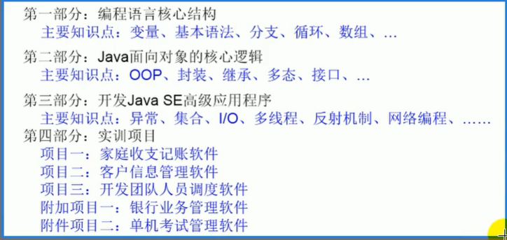

# 01.Java 语言概述

## 一.整体内容概述




## 二.Java 语言概述

### 1.基础常识

**软件**：即一系列按照特定顺序组织的计算机数据和指令集合。分为：系统软件 和 应用软件

**系统软件**：window、mac os、linux、unix、Android、iOS

应用软件**：word、ppt、画图板...**

\*\*应用程序 = 算法 + 数据结构

人机交互方式:\*\* 图形化界面 vs 命令行方式

常用 DOS 命令：

- dir：列出当前目录下的文件以及文件夹
- md：创建目录
- rd：删除目录
- cd：进入指定目录
- cd..：退回到上一级目录
- cd\:退回到根目录
- del:删除文件
- exit：退出 dos 命令行

### 2.计算机语言的发展迭代史

- 第一代：机器语言
- 第二代：汇编语言
- 第三代：高级语言
  - 面向对象：Java、Js、Python...
  - 面向过程：C

### 3.Java 语言版本迭代概述

- 1991 年 Green 项目，开发语言最初命名为 Oak(橡树)
- 1994 年，开发组意识到 Oak 非常适合与互联网
- 1996 年，发布 JDK1.0,约 8.3 个网页应用 Java 技术来制作
- 1997 年，发布 JDK1.1,JavaOne 会议召开，创当时全球同类会议规模之最
- 1998 年，发布 JDK1.2，同年发布企业平台 J2EE
- 1999 年，Java 分成 J2SE、J2EE 和 J2ME,JSP/Servle 技术诞生
- **2004 年，发布里程碑式版本，JDK1.5，为突出次版本的重要性，更名为 JDK5.0**
- 2005 年，J2SE->JavaSE，J2EE->JavaEE，J2ME->JavaME
- 2009 年，Oracle 公司收购 SUN，交易价格 74 亿美元
- 2011 年，发布 JDK7.0
- **2014 年，发布 JDK8.0，是继 JDK5.0 以来变化最大的版本**
- 2017 年，发布 JDK9.0，最大限度实现模块化
- 2018 年 3 月，发布 JDK10.0，版本号也称为 18.3
- 2018 年 9 月，发布 JDK11.0，版本号也称为 18.9

### 4.Java 语言应用的领域

- Java Web 开发：后台开发
- 大数据开发
- Android 应用程度开发：客户端开发

### 5.Java 语言的特点

- 面向对象性：
  - 两个要素：类、对象
  - 三个特征：封装、继承、多态
- 健壮性：
  - 去除了 C 语言中的指针
  - 自动的垃圾回收机制（仍然会出现内存溢出、内存泄漏）
- 跨平台性：一次编译，到处运行

## 三.开发环境的搭建（重点）

### 1.JDK,JRE,JVM 三者之间的关系，以及 JDK、JRE 包含的主要结构有哪些

```bash
 JDK = JRE + Java的开发工具 （javac.exe,java.exe,javadoc.exe）

 JRE = JVM + Java核心类库
```

### 2.JDK 的下载、安装

下载：官网，github

安装：傻瓜式安装

注意问题（路径中不能包含中文、空格）

### 3.为什么要配置 path 环境变量？如何配置？

path 环境变量：windows 操作系统执行命令时所要搜寻的路径

希望 java 的开发工具（javac.exe,java.exe,javadoc.exe）在任何文件路径下都可以执行成功

```bash
 JAVA_HOME = bin 的上层目录

 path = %JAVA_HOME%\bin
```

## 四.第一个 Java 程序

### 1.开发体验-HelloWorld

#### 1.1 编写

创建一个 java 源文件 HelloWorld.java

```java
 class HelloWorld{
     public static void main(String[] args){
         System.out.println("Hello,World!");
     }
 }
```

#### 1.2 编译

```bash
 javac HelloWorld.java
```

#### 1.3 运行

```bash
 java HelloWorld
```

### 2.常见问题的解决

- 源文件名不存在或者写错
- 当前路径错误
- 后缀名隐藏问题
- 类文件名写错，尤其文件名与类名不一致时，要小心
- 类文件不能在当前路径下，或者不在 classpath 指定路径下

### 3.总结第一个程序

1. java 程序编写-编译-运行的过程编写：我们将编写的 java 代码报错在以.java 结尾的源文件中编译：使用 javac.exe 命令编译我们的 java 源文件。格式 javac 源文件名.java 运行: 使用 java.exe 命令解释运行我们的字节码文件。格式 java 类名
2. 在一个 java 源文件中可以声明多个 class。但是，最多只能有一个类声明为 public 的，而且要求声明为 public 的类的类名必须与源文件名相同。
3. 程序的入口是 main()方法。格式是固定的
4. 输出语句：
   - System.out.println():先输出数据，然后换行
   - System.out.print():只输出数据
5. 每一行执行语句都以;结束。
6. 编译的过程：编译以后，会生成一个或多个字节码文件。字节码文件的文件名与 java 源文件中的类名相同

## 五.注释与 API 文档等

### 1.注释：Comment

**分类：**

- 单行注释：//
- 多行注释：/\* \*/
- 文档注释：/\*\* \*/

**作用：**

- 对所写的程序进行解释说明，增强可读性。方便自己，方便别人
- 调试所写的代码

**特点：**

- 单行注释和多行注释，注释了的内容不参与编译。换句话说，变异以后生成的.class 结尾的字节码文件中不包含注释掉的信息
- 注释内容可以被 JDK 提供的工具 javadoc 所解析，生成一套以网页文件形式体现的该程序的说明文档。
- 多行注释不可以嵌套使用

### 2.Java API 文档

API 习惯上：将语言提供的类库，都称为 api

API 文档：针对于提供的类库如何使用，给的一个说明书。类似于《新华字典》。

### 3.良好的编程风格

- 正确的注释和注释风格
  - 使用文档注释来注释整个类或整个方法。
  - 如果注释方法中的某一个步骤，使用单行或多行注释。
- 正确的缩进和空白
  - 使用一次 tab 操作，实现缩进
  - 运算符两边习惯性各加一个空格。比如:2 + 4 = 6
- 块的风格
  - Java API 源码选择了行尾风格
 
 