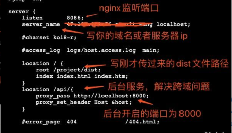

# Nginx 常用命令



## 1.常用命令

- nginx -V 查看版本
- start nginx 启动 Nginx
- nginx -s stop 快速停止或关闭
- nginx -s quit 正常停止或关闭
- nginx -s reload 重新加载配置文件

### 1.1 停止 Nginx 服务的四种方法

- 从容停止服务
  这种方法较 stop 相比就比较温和一些了，需要进程完成当前工作后再停止。nginx -s quit
- 立即停止服务
  这种方法比较强硬，无论进程是否在工作，都直接停止进程。nginx -s stop
- systemctl 停止
  systemctl 属于 Linux 命令 systemctl stop nginx.service
- killall 方法杀死进程
  直接杀死进程，在上面无效的情况下使用，态度强硬，简单粗暴！killall nginx

## 2.配置静态网站

```javascript
server {
    listen       80;
    server_name  mytestdoamin.com;
    location / {
        root d:/html;
        index index.html;
    }
}
```

## 3.配置跨域

```javascript

    server {
        listen       80;
        server_name   localhost;

        #charset koi8-r;

        #access_log  logs/host.access.log  main;


  location  ~/probe/* {
   proxy_pass http://11.145.8.125:18300;
  }

  location / {
            root   html;
            index  index.html index.htm;
        }
```

## 4.配置前端页面刷新 404

```javascript
  location / {
    # ...
    # 增加下列命令，index.html可换为项目中使用的其它文件名
    try_files $uri $uri/ /index.html;
  }
```
 
 
 <git-talk/>