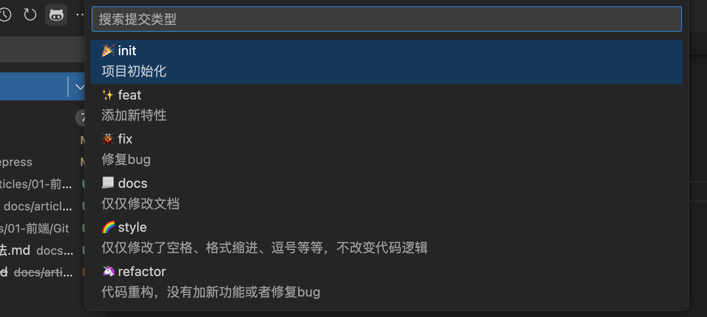

# git 规范

git 规范包括两点：分支管理规范、git commit 规范。

## 1.分支管理规范

- `master` 用于保存上线的代码
- `develop` 用于保存相对稳定代码，所有的`feature`分支都是通过该分支创建
- `feature` 用于开发新的功能分支， 不同的功能应创建不同的功能分支
- `release` 用于代码上线前准备（测试、文档完善、bug修复）该分支基于`develop`分支创建 ---- 完善后直接提交至`master`
- `bugfix` 用于修复不紧急的`bug` 一般基于`release`创建，测试过程中出现的`bug`
- `hotfix` 用于需要紧急修复的bug 一般基于`master`创建，线上`bug`需要立即修复

## 2.git commit 规范

```bash
<type>(<scope>): <subject>
<BLANK LINE>
<body>
<BLANK LINE>
<footer>
```

### Header

#### type（必填）

```zsh
# 主要 type
feat:     增加新功能
fix:      修复 bug

# 特殊type
docs:     只改动了文档相关的内容
style:    不影响代码含义的改动，例如去掉空格、改变缩进、增删分号
build:    构造工具的或者外部依赖的改动，例如 webpack，npm
refactor: 代码重构时使用
revert:   执行 git revert 打印的 message

# 暂不使用type
test:     添加测试或者修改现有测试
perf:     提高性能的改动
ci:       与 CI（持续集成服务）有关的改动
chore:    不修改 src 或者 test 的其余修改，例如构建过程或辅助工具的变动
```

#### scope（非必填）

`scope` 用于说明 `commit` 影响的范围，比如数据层、控制层、视图层等等，视实际使用情况而定

#### subject（必填）

`subject` 用于说明 `commit` 目的的简短描述，不超过50个字符

### Body

`body` 用于说明 `commit` 的详细描述，内容可以分成多行，主要描述改动之前的情况及修改动机，对于小的修改不作要求，但是重大需求、更新等尽量添加 body 来作说明

### Footer

#### break changes

`break changes` 用于说明是否产生了破坏性修改(不兼容变动)，涉及 `break changes` 的改动必须指明该项，类似版本升级、接口参数减少、接口删除、迁移等。

#### affect issues

`affect issues`  用于说明是否影响了某个`issue`

### commit 前缀

目前主流的前缀包括以下部分：

- build：表示构建，发布版本可用这个
- ci：更新 CI/CD 等自动化配置
- chore：杂项，其他更改
- docs：更新文档
- feat：常用，表示新增功能
- fix：常用：表示修复 bug
- perf：性能优化
- refactor：重构
- revert：代码回滚
- style：样式更改
- test：单元测试更改

示例:

### fix（修复 BUG）

如果修复的这个 BUG 只影响当前修改的文件，可不加范围。如果影响的范围比较大，要加上范围描述。

例如这次 BUG 修复影响到全局，可以加个 global。如果影响的是某个目录或某个功能，可以加上该目录的路径，或者对应的功能名称。

```bash
// 示例1
fix(global):修复checkbox不能复选的问题
// 示例2 下面圆括号里的 common 为通用管理的名称
fix(common): 修复字体过小的BUG，将通用管理下所有页面的默认字体大小修改为 14px
// 示例3
fix: value.length -> values.length
```

### feat（添加新功能或新页面）

```bash
feat: 添加网站主页静态页面

这是一个示例，假设对点检任务静态页面进行了一些描述。

这里是备注，可以是放BUG链接或者一些重要性的东西。
```

### chore（其他修改）

chore 的中文翻译为日常事务、例行工作，顾名思义，即不在其他 commit 类型中的修改，都可以用 chore 表示。

```bash
chore: 将表格中的查看详情改为详情
```

其他类型的 commit 和上面三个示例差不多，就不说了。

### Vscode 插件

可以使用`git-commit-plugin`这个插件



## 3.Git hooks

|   **pre-commit**   |         `git commit`执行前         |             可以通过`git commit --no-verify`绕过             |
| :----------------: | :--------------------------------: | :----------------------------------------------------------: |
|   **commit-msg**   |         `git commit`执行前         |              可以用`git commit --no-verify`绕过              |
|    post-commit     |         `git commit`执行后         |                   不影响`git commit`的结果                   |
|  pre-merge-commit  |         `git merge`执行前          |             可以用`git merge --no-verify`绕过。              |
| prepare-commit-msg | `git commit`执行后，编辑器打开之前 |                                                              |
|     pre-rebase     |         `git rebase`执行前         |                                                              |
|   post-checkout    | `git checkout`或`git switch`执行后 | 如果不使用`--no-checkout`参数，则在`git clone`之后也会执行。 |
|     post-merge     |         `git commit`执行后         |                 在执行`git pull`时也会被调用                 |
|      pre-push      |          `git push`执行前          |                                                              |
 
 