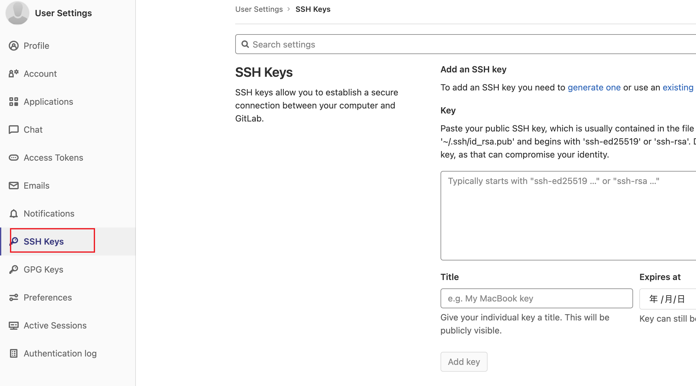
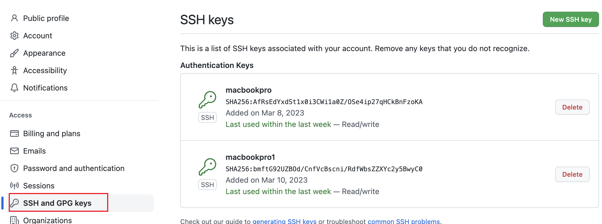

# git 配置多个 SSH-Key

一般公司使用 `GitLab` 搭建的内部私有 `Git` 仓库，同时自己平时用 `github` 的账号，存在两个`Git`，如果直接使用 SSH-Key 会把之前的`GitLab`的 SSH-Key 覆盖。

> 有两个 Github 账号，同一台电脑同时连接两个账号进行版本控制。
> 公司使用 Gitlab 账号，自己使用 Github 账号。

## 1.查看 Git 全局设置

```bash
git config --list
```

设置 `user.name` 和 `user.email`

```bash
 git config --global user.name "your_name"
 git config --global user.email  "your_email"
```

删除全局设置的方法：

```bash
 git config --global --unset user.name "your_name"
 git config --global --unset user.email  "your_email"
```

## 2.生成新的 SSH keys

生成 SSH keys 命令

```bash
ssh-keygen -t rsa -C "your_email"
```

### 2.1 生成 GitLab 账号的 SSH-Keys

1、用命令在控制台生成私钥和私钥

```bash
# 在~/.ssh/目录会生成gitlab_id_rsa和gitlab_id_rsa.pub私钥和公钥。
# 我们将gitlab_id-rsa.pub中的内容粘帖到公司GitLab服务器的SSH-key的配置中。
ssh-keygen -t rsa -C "your_email" -f ~/.ssh/gitlab_id_rsa
```

2、在 GitLab 管理面板设置，复制公钥 `gitlab_id_rsa.pub` 的内容到密钥框。

可用命令查看，也可以用编辑器查看。

```bash
cat gitlab_id_rsa.pub
```

SSH 密钥设置面板



### 2.2 生成 Github 账号的 SSH-Keys

1、用命令在控制台生成私钥和私钥

```bash
# 在~/.ssh/目录会生成github_id_rsa和github_id_rsa.pub私钥和公钥。
# 我们将github_id_rsa.pub中的内容粘帖到Github的SSH-key的配置中。
ssh-keygen -t rsa -C "your_email" -f ~/.ssh/github_id_rsa
```

2、在 Github 管理面板设置，复制公钥 `github_id_rsa.pub` 的内容到密钥框。

可用命令查看，也可以用编辑器查看。

```bash
cat github_id_rsa.pub
```

SSH 密钥设置面板



### 2.3 添加 conig 配置文件

在~/.ssh 目录下添加`config`配置文件用于区分多个`SSH-Key`

```bash
# 添加config配置文件
# vi ~/.ssh/config

# 文件内容如下：
# gitlab
Host gitlab.com
HostName gitlab.com
PreferredAuthentications publickey
IdentityFile ~/.ssh/gitlab_id_rsa
# github
Host github.com
HostName github.com
PreferredAuthentications publickey
IdentityFile ~/.ssh/github_id_rsa

# 配置文件参数
# Host : Host可以看作是一个你要识别的模式，对识别的模式，进行配置对应的的主机名和ssh文件
# HostName : 要登录主机的主机名
# User : 登录名
# IdentityFile : 指明上面User对应的identityFile路径
```

### 2.4 配置完，目录中的文件

```bash
cd ~/.ssh/

ls

github_id_rsa.pub
github_id_rsa
gitlab_id_rsa.pub
gitlab_id_rsa
known_hosts
```

## 3. 验证连接 Git

```bash
ssh -T git@github.com
```

如果连接不成功的话，用户命令查看错误信息

```bash
ssh -vT git@gihub.com  #查看出错信息
```

## 4. 无法连接问题

如果出现

```bash
Permission denied（Publickey）
```

解决方案：

以 `Github` 连接不上为例：

1、把私钥`github_id_rsa`，重新添加到`ssh_agent`，并验证连接

```bash
ssh-agent bash
ssh-add ~/.ssh/github_id_rsa
```

2、把公钥`github_id_rsa.pub`，重新添加到 `Git` 账号`SSH Keys`，再验证连接。

3、最终还是没办法连接成功，重新按上面步骤操作。
