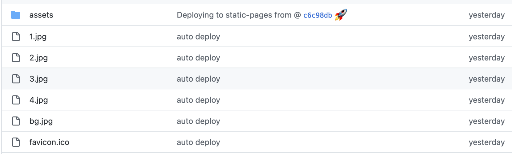
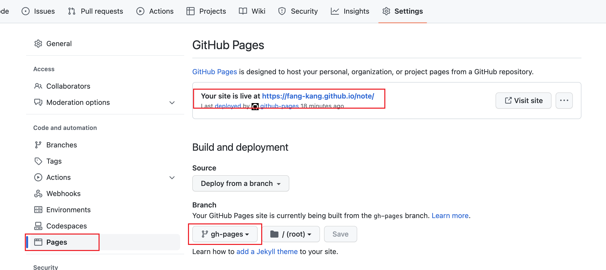
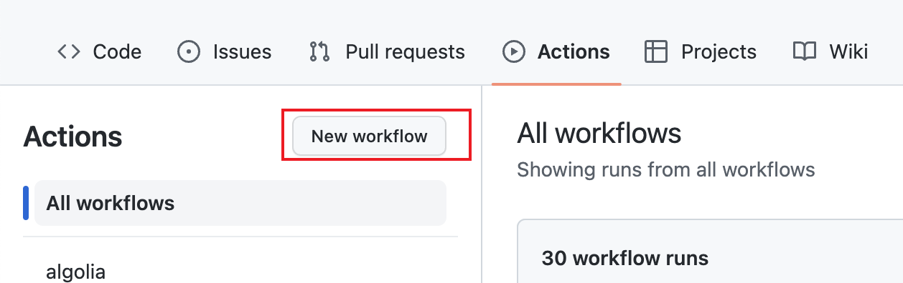
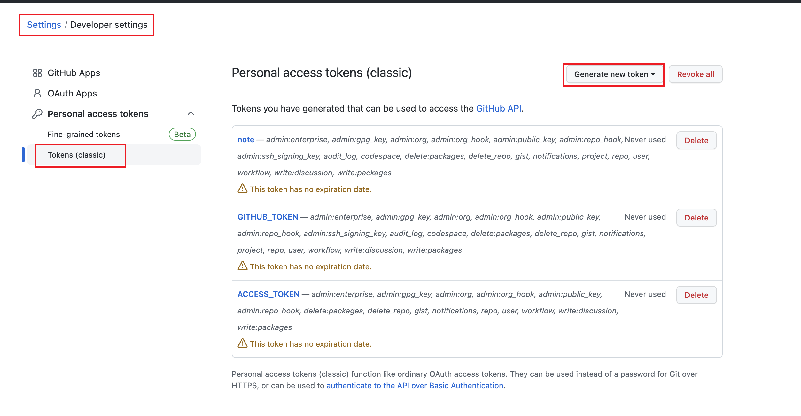

# 使用 Github 的 Action 实现博客的自动部署

## 一.自动化部署脚本

先来分享一种简单的自动化部署方案 - 自动化部署脚本

我们每次部署项目时，会有几个步骤是固定的，既然它是固定的，那么我们就可以通过写脚本来帮助我们完成，这样不仅能够提高我们的开发效率，还能避免人为操作时可能出现的纰漏。

### 1.添加脚本

我们直接在项目根目录下新建一个脚本文件`deploy.sh`

```bash
#!/usr/bin/env sh

set -x  # 这里是为了看错误日志

# 打包项目
npm run build

# 进入打包后的文件夹
cd dist

git init
git add -A
git commit -m 'auto deploy'

# 将打包后的文件推送到指定分支

git push -f https://github.com/xxx

```

### 2.执行脚本

现在我们可以执行`sh deploy.sh`，然后就会执行我们脚本文件中的内容，先是打包，然后将打包产物推送到远程指定分支（static-pages）。我们可以到 github 仓库中查看打包产物。



部署完我们怎么访问这个页面呢？

在仓库的`Setting -> Pages`中可以查看到该页面的访问地址



最后我们访问这个地址,就能看到我们部署的页面了。

这种方案最后再与`GitHooks`结合，可以在某个分支提交时自动完成打包部署，这里就不再介绍了。下面我们再来看另一种更加优雅的方案。

## 二.CICD

> CICD 翻译过来就是持续构建、持续交付。

### 1. CI 持续集成（Continuous Integration）

持续集成：频繁的将代码合并到主分支中，强调通过集成测试反馈给开发一个结果，不管失败还是成功。

持续集成分成三个阶段：

- 持续集成准备阶段：根据软件开发的需要，准备 CI 的一些前置工作
  - 集成 CI 工具的代码仓库（Gitlab、Github、Jenkins 等）
  - 单元测试或者集成测试的脚本
  - 触发 CI 的配置文件，实现各种功能的 Jobs
- 持续集成进行阶段
  - 推送代码出发 CI 系统
  - 通过 CI 系统监听代码的测试、构建，反馈集成结果
  - 通过版本管理系统实现版本的管理
- 接续集成完成阶段：反馈集成结果

### 2. CD 持续交付（Continuous Delivery）

持续交付：主要面向测试人员和产品，可以保证一键部署，常常要交付的内容包括

- 源代码：缺点，代码依赖的环境不容易控制
- 打包的二进制文件或者系统包：存在兼容性问题和环境差异出现的部署失败
- 虚拟机镜像交付：系统隔离最好，但占用系统资源严重
- Docker 交付：容器交付，成本最低，兼容性最好

持续部署：此时要提供一个稳定的版本，包括所需的环境和依赖，主要面向用户提供服务，发生错误要能快速回滚。

CICD 是目前大多数互联网公司选择的一种部署方案，因为它能够灵活配置项目部署过程中的各个阶段。下面再来介绍下如何使用 GitHub 的 CICD 来部署前端项目。

### 3.GitHub Action

`GitHub Actions` 是一个持续集成 (Continuous integration)和持续交付 (Continuous delivery)的平台，它可以做到自动化构建、测试、部署。你可以创建工作流，构建和测试每一个 `pull request` 或者部署合并后的代码到生产环境。

#### Workflows(工作流)

工作流是一个可配置的自动化的程序。创建一个工作流，你需要定义一个 YAML 文件，当你的仓库触发某个事件的时候，工作流就会运行，当然也可以手动触发，或者定义一个时间表。一个仓库可以创建多个工作流，每一个工作流都可以执行不同的步骤。

#### Events(事件)

事件是指仓库触发运行工作流的具体的行为，比如创建一个 `pull request`、新建一个 `issue`、或者推送一个 `commit`。你也可以使用时间表触发一个工作流，或者通过请求一个 REST API，再或者手动触发。

#### Jobs(任务)

任务是在同一个运行器上执行的一组步骤。一个步骤要么是一个 shell 脚本要么是一个动作。步骤会顺序执行，并彼此独立。因为每一个步骤都在同一个运行器上被执行，所以你可以从一个步骤传递数据到另一个步骤 。

你可以配置一个任务依赖其他任务，默认情况下，任务没有依赖，并行执行。当一个任务需要另外一个任务的时候，它会等到依赖的任务完成再执行。

#### Actions(动作)

动作是 `GitHub Actions` 平台的一个自定义的应用，它会执行一个复杂但是需要频繁重复的作业。使用动作可以减少重复代码。比如一个 action 可以实现从 GitHub 拉取你的 git 仓库，为你的构建环境创建合适的工具链等。你可以写自己的动作 ，或者在 GitHub 市场找已经实现好的动作。

#### Runners(运行器)

一个运行器是一个可以运行工作流的服务。每一个运行器一次只运行一个单独的任务。GitHub 提供 Ubuntu Linux，Microsoft Windows 和 macOS 运行器，每一个工作流都运行在一个独立新建的虚拟机中。如果你需要一个不同的操作系统，你可以自定义运行器。

了解完上面这些有关`GitHub Actions`的概念，我们开始搭建一条自己的工作流用于项目的部署。

### 4.搭建工作流

**.github/workflows**

我们在之前建好的仓库中点击`New workflow`来新建一条工作流。


然后会到选择工作流的页面



这里你可以选择一条别人建好的工作流，也可以选择新建自己的工作流。

我们还是选择新建自己的工作流

### 5.起步

首先在仓库的根目录下，创建 `.github/workflows/deploy.yml` 文件，这就是 `GitHub Actions` 功能的配置文件，用于告诉 `GitHub` 要做哪些事情，写入以下内容

```yaml
name: deploy

on:
  # 每当 push 到 master 分支时触发部署
  push:
    branches: [main]
  # 手动触发部署
  workflow_dispatch:

jobs:
  deploy:
    runs-on: ubuntu-latest

    steps:
      - uses: actions/checkout@v2
        with:
          # “最近更新时间” 等 git 日志相关信息，需要拉取全部提交记录
          fetch-depth: 0

      - name: Setup Node.js
        uses: actions/setup-node@v1
        with:
          # 选择要使用的 node 版本
          node-version: '14'

        # 安装pnpm
      - name: Setup pnpm
        run: npm i -g pnpm
      # 如果缓存没有命中，安装依赖
      - name: Install dependencies
        run: pnpm install --no-frozen-lockfile

      # 执行发布到库

      # 运行构建脚本
      - name: Build Blog
        run: pnpm docs:build
      # 查看 workflow 的文档来获取更多信息
      # @see https://github.com/crazy-max/ghaction-github-pages
      - name: Deploy to GitHub Pages
        uses: crazy-max/ghaction-github-pages@v2
        with:
          # 部署到 gh-pages 分支
          target_branch: gh-pages
          # 部署目录为
          build_dir: docs/.vitepress/dist/
        env:
          # @see https://docs.github.com/cn/actions/reference/authentication-in-a-workflow#about-the-github_token-secret
          GITHUB_TOKEN: ${{ secrets.GITHUB_TOKEN }}
```

`GitHub Actions` 工作流需要的全部内容，遵循 YAML 格式，这里我做一个大致的说明：

- `on` 表示触发条件
- `jobs` 表示要做的工作
- `jobs` 下的 `step` 表示要做的步骤，前一步失败，后面不会继续执行。
- `jobs` 下的 `step` 下有 `name、uses、with` 等，表示一个 action。
- `name` 表示 `action` 的名称，`uses` 表示使用哪个插件，`with` 表示传给插件的参数。
- `secrets.XXX` 这个 XXX 表示本仓库的环境变量，配置在仓库设置里面的 `secrets` 菜单拦，都是加密的。

`uses` 中用的就是别人写好的插件，持续集成由很多操作组成，比如抓取代码、运行测试、登录远程服务器，发布到第三方服务等等，这些操作都用共性，GitHub 就允许其他人把写好的插件共享到插件市场供其他人使用，因此如果你需要某个 `action`，不必自己写复杂的脚本，直接引用他人写好的 `action` 即可，你说方便不方便，插件市场见本文的学习资源小节。。

上述文件 `.github/workflows/deploy.yml` 写好之后，先别着急 push，一旦 push，这些 `actions` 就会执行，在参数正确的配置之前，报错那是肯定的。

### 6.参数

**secrets.GITHUB_TOKEN**



## 三.学习资源

如果要学习 GitHub Actions 来实现自己的部署流程，以下学习资源供你参考：

1. [GitHub Actions 入门教程](https://link.zhihu.com/?target=http%3A//www.ruanyifeng.com/blog/2019/09/getting-started-with-github-actions.html)。
2. [GitHub Actions 官方文档](https://link.zhihu.com/?target=https%3A//docs.github.com/en/actions)。
3. [GitHub Actions 官方插件市场](https://link.zhihu.com/?target=https%3A//github.com/marketplace%3Ftype%3Dactions)。
4. [awesome-actions](https://link.zhihu.com/?target=https%3A//github.com/sdras/awesome-actions)。
