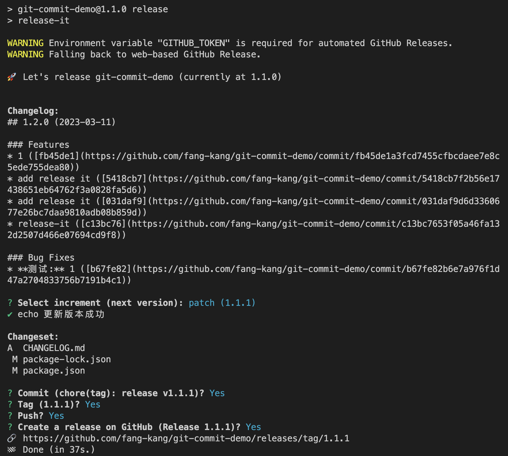

# release-it

## 1、release-it 能干什么

- 我们先正常提交我们自己的代码，需求或 bug 以及其他
- 自动根据上一个版本标签（Tag）与最新历史进行对比并产出日志
- conventional-changelog 将变更写入到 CHANGELOG.md
- 解析日志内容更新 package.json 的版本号
- 提交内容变化并打上版本标签
- 打开浏览器 github，发布 change-log 版本

## 2、安装 release-it

在项目根目录下安装依赖

```bash
npm i release-it @release-it/conventional-changelog -D
```

## 3、添加脚本

在 package.json 中添加脚本

```json
 "scripts": {
    "release": "release-it"
 }
```

## 4、release-it 单独配置.release-it.json

```json
{
  "github": {
    "release": true
  },
  "npm": {
    "publish": false
  },
  "hooks": {
    "after:bump": "echo 更新版本成功"
  },
  "plugins": {
    "@release-it/conventional-changelog": {
      "infile": "CHANGELOG.md",
      "ignoreRecommendedBump": true,
      "strictSemVer": true,
      "preset": {
        "name": "conventionalcommits",
        "types": [
          { "type": "feat", "section": "Features" },
          { "type": "fix", "section": "Bug Fixes" },
          { "type": "chore", "hidden": true },
          { "type": "docs", "hidden": true },
          { "type": "style", "hidden": true },
          { "type": "refactor", "hidden": true },
          { "type": "perf", "hidden": true },
          { "type": "test", "hidden": true }
        ]
      }
    }
  },
  "git": {
    "commitMessage": "chore(tag): release v${version}"
  }
}
```

:::tip

注意这里只配置了`feat`和`fix`类型会在`CHANGELOG.md`显示

:::

## 4、提交代码

假如我们变更了一部分代码，一般都要先提交 推送到代码服务器

```bash
git add .
git commit -m 'feat: release-it'
```

## 5、运行 release

```bash
npm run release
```

一路选择后便可以执行完成了


