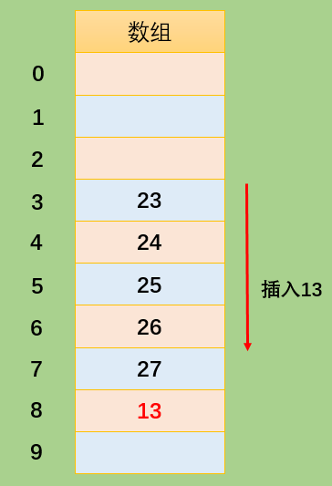
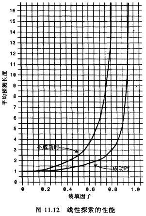
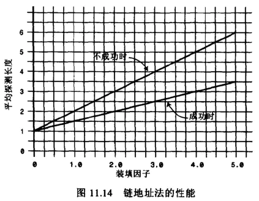
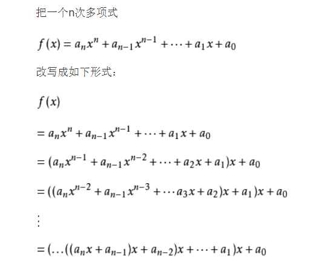
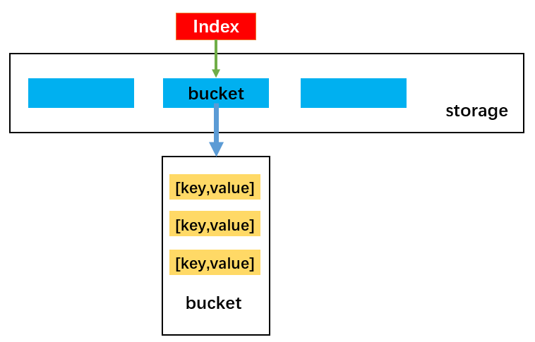
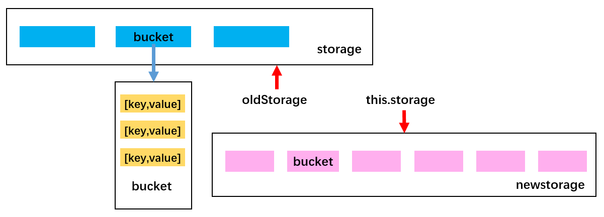

# 十、哈希表

## 认识哈希表

哈希表是一种非常重要的数据结构，几乎所有的编程语言都直接或者间接应用这种数据结构。

哈希表通常是基于数组实现的，但是相对于数组，它存在更多优势：

- 哈希表可以提供非常快速的 **插入-删除-查找** 操作。
- 无论多少数据，插入和删除值都只需接近常量的时间，即 **O(1)** 的时间复杂度。实际上，只需要几个机器指令即可完成。
- 哈希表的速度比树还要快，基本可以瞬间查找到想要的元素。
- 哈希表相对于树来说编码要简单得多。

哈希表同样存在不足之处：

- 哈希表中的数据是没有顺序的，所以不能以一种固定的方式（比如从小到大 ）来遍历其中的元素。
- 通常情况下，哈希表中的 `key` 是不允许重复的，不能放置相同的 `key`，用于保存不同的元素。

哈希表是什么？

- 哈希表并不好理解，不像数组、链表和树等可通过图形的形式表示其结构和原理。
- 哈希表的结构就是数组，但它**神奇之处在于对下标值的一种变换**，这种变换我们可以称之为**哈希函数**，通过哈希函数可以获取 HashCode。

通过以下案例了解哈希表：

- 案例一：公司想要存储 1000 个人的信息，每一个工号对应一个员工的信息。若使用数组，增删数据时比较麻烦；使用链表，获取数据时比较麻烦。有没有一种数据结构，能把某一员工的姓名转换为它对应的工号，再根据工号查找该员工的完整信息呢？没错此时就可以使用哈希表的哈希函数来实现。
- 案例二：存储联系人和对应的电话号码：当要查找张三（比如）的号码时，若使用数组：由于不知道存储张三数据对象的下标值，所以查找起来十分麻烦，使用链表时也同样麻烦。而使用哈希表就能通过哈希函数把张三这个名称转换为它对应的下标值，再通过下标值查找效率就非常高了。

也就是说：哈希表最后还是基于数据来实现的，只不过哈希表能够通过哈希函数把字符串转化为对应的下标值，建立字符串和下标值的映射关系。

### 认识哈希化

为了把字符串转化为对应的下标值，需要有一套编码系统，为了方便理解我们创建这样一套编码系统：比如 a 为 1，b 为 2，c 为 3，以此类推 z 为 26，空格为 27（不考虑大写情况）。

有了编码系统后，将字母转化为数字也有很多种方案：

- 方案一：数字相加。

例如 cats 转化为数字：`3 + 1 + 20 + 19 = 43`，那么就把 43 作为 cats 单词的下标值储存在数组中；

但是这种方式会存在这样的问题：很多的单词按照该方式转化为数字后都是 43，比如 was。而在数组中一个下标值只能储存一个数据，所以该方式不合理。

- 方案二：幂的连乘。

我们平时使用的大于 10 的数字，就是用幂的连乘来表示它的唯一性的。
比如： `6543 = 6 * 10^3 + 5 * 10^2 + 4 * 10 + 3`；这样单词也可以用该种方式来表示：`cats = 3 * 27^3 + 1 * 27^2 + 20 * 27 + 17 = 60337`。

虽然该方式可以保证字符的唯一性，但是如果是较长的字符（如 aaaaaaaaaa）所表示的数字就非常大，此时要求很大容量的数组，然而其中却有许多下标值指向的是无效的数据（比如不存在 zxcvvv 这样的单词），造成了数组空间的浪费。

两种方案总结：

- 第一种方案（让数字相加求和）产生的数组下标太少。
- 第二种方案（与 27 的幂相乘求和）产生的数组下标又太多。

现在需要一种压缩方法，把幂的连乘方案系统中得到的**巨大整数范围压缩到可接受的数组范围中**。可以通过**取余**操作来实现。虽然取余操作得到的结构也有可能重复，但是可以通过其他方式解决。

### 哈希表的一些概念

- **哈希化**

  将**大数字**转化成**数组范围内下标**的过程，称之为哈希化。

- **哈希函数**

  我们通常会将单词转化成大数字，把大数字进行哈希化的代码实现放在一个函数中，该函数就称为哈希函数。

- **哈希表**

  对最终数据插入的数组进行整个结构的封装，得到的就是哈希表。

### 地址的冲突

在实际中，经过哈希函数哈希化过后得到的下标值可能有重复，这种情况称为冲突，冲突是不可避免的，我们只能解决冲突。

解决冲突常见的两种方案：链地址法（拉链法）和开放地址法。

#### 链地址法（拉链法）

如下图所示，我们将每一个数字都对 10 进行取余操作，则余数的范围 0~9 作为数组的下标值。并且，数组每一个下标值对应的位置存储的不再是一个数字了，而是存储由经过取余操作后得到相同余数的数字组成的数组或链表。


这样可以根据下标值获取到整个数组或链表，之后继续在数组或链表中查找就可以了。而且，产生冲突的元素一般不会太多。

总结：链地址法解决冲突的办法是每个数组单元中存储的不再是单个数据，而是一条链条，这条链条常使用的数据结构为数组或链表，两种数据结构查找的效率相当（因为链条的元素一般不会太多）。

#### 开放地址法

开放地址法的主要工作方式是寻找空白的单元格来放置冲突的数据项。


根据探测空白单元格位置方式的不同，可分为三种方法：

- 线性探测
- 二次探测
- 再哈希法

##### 线性探测

- 当插入 13 时：

经过哈希化（对 10 取余）之后得到的下标值 index=3，但是该位置已经放置了数据 33。而线性探测就是从 index 位置+1 开始向后一个一个来查找合适的位置来放置 13，所谓合适的位置指的是空的位置，如上图中 index=4 的位置就是合适的位置。

- 当查询 13 时：
  - 首先 13 经过哈希化得到 index=3，如果 index=3 的位置存放的数据与需要查询的数据 13 相同，就直接返回；
    不相同时，则线性查找，从 index+1 位置开始一个一个位置地查找数据 13。
  - 查询过程中不会遍历整个哈希表，只要查询到空位置，就停止，因为插入 13 时不会跳过空位置去插入其他位置。
- 当删除 13 时：
  - 删除操作和上述两种情况类似，但需要注意的是，删除一个数据项时，不能将该位置下标的内容设置为 null，否则会影响到之后其他的查询操作，因为一遇到为 null 的位置就会停止查找。
  - 通常删除一个位置的数据项时，我们可以将它进行特殊处理（比如设置为-1），这样在查找时遇到-1 就知道要继续查找。

线性探测存在的问题：

- 线性探测存在一个比较严重的问题，就是聚集。
- 如哈希表中还没插入任何元素时，插入 23、24、25、26、27，这就意味着下标值为 3、4、5、6、7 的位置都放置了数据，这种一连串填充单元就称为聚集。
- 聚集会影响哈希表的性能，无论是插入/查询/删除都会影响。
- 比如插入 13 时就会发现，连续的单元 3~7 都不允许插入数据，并且在插入的过程中需要经历多次这种情况。二次探测法可以解决该问题。



##### 二次探测

上文所说的线性探测存在的问题：

- 如果之前的数据是连续插入的，那么新插入的一个数据可能需要探测很长的距离；

  二次探测是在线性探测的基础上进行了优化：

- 线性探测：我们可以看成是步长为 1 的探测，比如从下表值 x 开始，那么线性探测就是按照下标值：x+1、x+2、x+3 等依次探测；

- 二次探测：对步长进行了优化，比如从下标值 x 开始探测：x+1^2^、x+2^2^、x+3^3^ 。这样一次性探测比较长的距离，避免了数据聚集带来的影响。

- 二次探测存在的问题：

  当插入数据分布性较大的一组数据时，比如：13-163-63-3-213，这种情况会造成步长不一的一种聚集（虽然这种情况出现的概率较线性探测的聚集要小），同样会影响性能。

##### 再哈希法

在开放地址法中寻找空白单元格的最好的解决方式为再哈希化。

- 二次探测的步长是固定的：1，4，9，16 依次类推。
- 现在需要一种方法：产生一种依赖关键字(数据)的探测序列，而不是每个关键字探测步长都一样。
- 这样，不同的关键字即使映射到相同的数组下标，也可以使用不同的探测序列。
- 再哈希法的做法为：把关键字用另一个哈希函数，再做一次哈希化，用这次哈希化的结果作为该关键字的步长。

第二次哈希化需要满足以下两点：

- 和第一个哈希函数不同，不然哈希化后的结果仍是原来位置；
- 不能输出为 0，否则每次探测都是原地踏步的死循环；

优秀的哈希函数：

- stepSize = constant - （key % constant）；
- 其中 constant 是质数，且小于数组的容量；
- 例如：stepSize = 5 - （key % 5），满足需求，并且结果不可能为 0；

哈希化的效率

哈希表中执行插入和搜索操作效率是非常高的。

- 如果没有发生冲突，那么效率就会更高；
- 如果发生冲突，存取时间就依赖后来的探测长度；
- 平均探测长度以及平均存取时间，取决于填装因子，随着填装因子变大，探测长度会越来越长。

#### 装填因子

- 装填因子表示当前哈希表中已经包含的数据项和整个哈希表长度的比值；
- 装填因子 = 总数据项 / 哈希表长度；
- 开放地址法的装填因子最大为 1，因为只有空白的单元才能放入元素；
- 链地址法的装填因子可以大于 1，因为只要愿意，拉链法可以无限延伸下去；

#### 不同探测方式性能的比较

- 线性探测

  可以看到，随着装填因子的增大，平均探测长度呈指数形式增长，性能较差。实际情况中，最好的装填因子取决于存储效率和速度之间的平衡，随着装填因子变小，存储效率下降，而速度上升。

  

- 二次探测和再哈希化的性能

  二次探测和再哈希法性能相当，它们的性能比线性探测略好。由下图可知，随着装填因子的变大，平均探测长度呈指数形式增长，需要探测的次数也呈指数形式增长，性能不高。

  

- 链地址法的性能

  可以看到随着装填因子的增加，平均探测长度呈线性增长，较为平缓。在开发中使用链地址法较多，比如 Java 中的 HashMap 中使用的就是链地址法。

  

### 哈希函数

哈希表的优势在于它的速度，所以哈希函数不能采用消耗性能较高的复杂算法。提高速度的一个方法是在哈希函数中尽量减少乘法和除法。

性能高的哈希函数应具备以下两个优点：

- 快速的计算；
- 均匀的分布；

#### 快速计算

霍纳法则：在中国霍纳法则也叫做秦久韶算法，具体算法为：



求多项式的值时，首先计算最内层括号内一次多项式的值，然后由内向外逐层计算一次多项式的值。这种算法把求 n 次多项式 f(x)的值就转化为求 n 个一次多项式的值。

- 变换之前：
  - 乘法次数：n(n+1)/2 次；
  - 加法次数：n 次；
- 变换之后：
  - 乘法次数：n 次；
  - 加法次数：n 次；

如果使用大 O 表示时间复杂度的话，直接从变换前的 O(N^2)降到了 O(N)。

#### 均匀分布

在设计哈希表时，我们已经有办法处理映射到相同下标值的情况：链地址法或者开放地址法。但是，为了提供效率，最好的情况还是让数据在哈希表中均匀分布。因此，我们需要在使用常量的地方，尽量使用质数。比如：哈希表的长度、N 次幂的底数等。

Java 中的 HashMap 采用的是链地址法，哈希化采用的是公式为：index = HashCode(key) & (Length-1) 即将数据化为二进制进行与运算，而不是取余运算。这样计算机直接运算二进制数据，效率更高。但是 JavaScript 在进行较大数据的与运算时会出现问题，所以我们使用 JavaScript 实现哈希化时采用取余运算。

## 封装哈希表

### 哈希表常见操作

- `put(key, value)` 插入或修改操作。
- `get(key)` 获取哈希表中特定位置的元素。
- `remove(key)` 删除哈希表中特定位置的元素。
- `isEmpty()` 如果哈希表中不包含任何元素，返回 `trun`，如果哈希表长度大于 0 则返回 `false`。
- `size()` 返回哈希表包含的元素个数。
- `resize(value)` 对哈希表进行扩容操作。

### 哈希函数的简单实现

首先使用霍纳法则计算 hashCode 的值，通过取余操作实现哈希化，此处先简单地指定数组的大小。

```js
hashFn(string, limit = 7) {

  // 自己采用的一个质数（无强制要求，质数即可）
  const PRIME = 31;

  // 1、定义存储 hashCode 的变量
  let hashCode = 0;

  // 2、使用霍纳法则（秦九韶算法），计算 hashCode 的值
  for (let item of string) {
    hashCode = PRIME * hashCode + item.charCodeAt();
  }

  // 3、对 hashCode 取余，并返回
  return hashCode % limit;
}
```

哈希函数测试

```js
console.log(hashFn('123')) //--> 5
console.log(hashFn('abc')) //--> 6
```

### 哈希表的实现

#### 创建哈希表类

封装的哈希表的数据结构模型：


首先创建哈希表类 HashTable，并添加必要的属性和上面实现的哈希函数，再进行其他方法的实现。

```js
class HashTable {
  constructor() {
    this.storage = [] // 哈希表存储数据的变量
    this.count = 0 // 当前存放的元素个数
    this.limit = 7 // 哈希表长度（初始设为质数 7）
  }
}
```

#### put(key,value)

哈希表的插入和修改操作是同一个函数：因为，当使用者传入一个 `[key, value]` 时，如果原来不存在该 key，那么就是插入操作，如果原来已经存在该 key，那么就是修改操作。



实现思路：

- 首先，根据 key 获取索引值 index，目的为将数据插入到 storage 的对应位置；
- 然后，根据索引值取出 bucket，如果 bucket 不存在，先创建 bucket，随后放置在该索引值的位置；
- 接着，判断新增还是修改原来的值。如果已经有值了，就修改该值；如果没有，就执行后续操作。
- 最后，进行新增数据操作。

代码实现

```js
// put(key, value) 往哈希表里添加数据
put(key, value) {

  // 1、根据 key 获取要映射到 storage 里面的 index（通过哈希函数获取）
  const index = hashFn(key, this.limit);

  // 2、根据 index 取出对应的 bucket
  let bucket = this.storage[index];

  // 3、判断是否存在 bucket
  if (bucket === undefined) {
    bucket = [];  // 不存在则创建
    this.storage[index] = bucket;
  }

  // 4、判断是插入数据操作还是修改数据操作
  for (let i = 0; i < bucket.length; i++) {
    let tuple = bucket[i]; // tuple 的格式：[key, value]
    if (tuple[0] === key) { // 如果 key 相等，则修改数据
      tuple[1] = value;
      return; // 修改完 tuple 里数据，return 终止不再往下执行。
    }
  }

  // 5、bucket 新增数据
  bucket.push([key, value]); // bucket 存储元组 tuple，格式为 [key, value]
  this.count++;

  // 判断哈希表是否要扩容，若装填因子 > 0.75，则扩容
  if (this.count / this.limit > this.loadFactor) {
    this.resize(this.getPrime(this.limit * 2));
  }

}
```

#### get(key)

实现思路：

- 首先，根据 key 通过哈希函数获取它在 `storage` 中对应的索引值 `index`。
- 然后，根据索引值获取对应的 `bucket`。
- 接着，判断获取到的 `bucket` 是否为 `null`，如果为 `null`，直接返回 `null`。
- 随后，线性遍历 `bucket` 中每一个 `key` 是否等于传入的 `key`。如果等于，直接返回对应的 `value`。
- 最后，遍历完 `bucket` 后，仍然没有找到对应的 `key`，直接 `return null` 即可。

代码实现

```js
// 根据 get(key) 获取 value
get(key) {

  const index = hashFn(key, this.limit);
  const bucket = this.storage[index];

  if (bucket === undefined) {
    return null;
  }

  for (const tuple of bucket) {
    if (tuple[0] === key) {
      return tuple[1];
    }
  }
  return null;
}
```

#### remove(key)

实现思路：

- 首先，根据 key 通过哈希函数获取它在 `storage` 中对应的索引值 `index`。
- 然后，根据索引值获取对应的 `bucket`。
- 接着，判断获取到的 `bucket` 是否为 `null`，如果为 `null`，直接返回 `null`。
- 随后，线性查找 `bucket`，寻找对应的数据，并且删除。
- 最后，依然没有找到，返回 `null`。

```js
// remove(key) 删除指定 key 的数据
remove(key) {

  const index = hashFn(key, this.limit);
  const bucket = this.storage[index];

  if (bucket === undefined) {
    return null;
  }

  // 遍历 bucket，找到对应位置的 tuple，将其删除
  for (let i = 0, len = bucket.length; i < len; i++) {
    const tuple = bucket[i];
    if (tuple[0] === key) {
      bucket.splice(i, 1); // 删除对应位置的数组项
      this.count--;

      // 根据装填因子的大小，判断是否要进行哈希表压缩
      if (this.limit > 7 && this.count / this.limit < this.minLoadFactor) {
        this.resize(this.getPrime(Math.floor(this.limit / 2)));
      }

      return tuple;
    }

  }

}
```

#### isEmpty()

```js
isEmpty() {
  return this.count === 0;
}
```

#### size()

```js
size() {
  return this.count;
}
```

## 哈希表的扩容与压缩

为什么需要扩容？

- 前面我们在哈希表中使用的是长度为 7 的数组，由于使用的是链地址法，装填因子(loadFactor)可以大于 1，所以这个哈希表可以无限制地插入新数据。
- 但是，随着数据量的增多，storage 中每一个 `index` 对应的 `bucket` 数组（链表）就会越来越长，这就会造成哈希表效率的降低。

什么情况下需要扩容？

- 常见的情况是 `loadFactor > 0.75` 的时候进行扩容。

如何进行扩容？

- 简单的扩容可以直接扩大两倍（关于质数，之后讨论）。
- 扩容之后所有的数据项都要进行同步修改。

实现思路：

- 首先，定义一个变量，比如 oldStorage 指向原来的 `storage`。
- 然后，创建一个新的容量更大的数组，让 `this.storage` 指向它。
- 最后，将 oldStorage 中的每一个 bucket 中的每一个数据取出来依次添加到 `this.storage` 指向的新数组中。



### resize() 的实现

装填因子 = 哈希表中数据 / 哈希表长度，即 `loadFactor = count / HashTable.length`。

resize 方法，既可以实现哈希表的扩容，也可以实现哈希表容量的压缩。

```js
// 重新调整哈希表大小，扩容或压缩
resize(newLimit) {

  // 1、保存旧的 storage 数组内容
  const oldStorage = this.storage;

  // 2、重置所有属性
  this.storage = [];
  this.count = 0;
  this.limit = newLimit;

  // 3、遍历 oldStorage，取出所有数据，重新 put 到 this.storage
  for (const bucket of oldStorage) {
    if (bucket) {
      for (const b of bucket) {
        this.put(b[0], b[1]);
      }
    }

  }
}
```

- 通常情况下当装填因子 `laodFactor > 0.75` 时，对哈希表进行扩容。在哈希表中的添加方法（push 方法）中添加如下代码，判断是否需要调用扩容函数进行扩容。

  ```js
  // 判断哈希表是否要扩容，若装填因子 > 0.75，则扩容
  if (this.count / this.limit > this.loadFactor) {
    this.resize(this.getPrime(this.limit * 2))
  }
  ```

- 当装填因子 `laodFactor < 0.25` 时，对哈希表容量进行压缩。在哈希表中的删除方法（remove 方法）中添加如下代码，判断是否需要调用扩容函数进行压缩。

  ```js
  // 根据装填因子的大小，判断是否要进行哈希表压缩
  if (this.limit > 7 && this.count / this.limit < this.minLoadFactor) {
    this.resize(this.getPrime(Math.floor(this.limit / 2)))
  }
  ```

### 选择质数作为哈希表容量

#### 质数判断

> 1 不是质数

- 方法一：针对质数的特点：只能被 1 和 number 整除，不能被 2 ~ (number-1)整除。遍历 2 ~ (num-1) 。

  这种方法虽然能实现质数的判断，但是效率不高。

  ```js
  function isPrime(number) {
    if (number <= 1) return false
    for (let i = 2; i < number; i++) {
      if (number % i === 0) {
        return false
      }
    }
    return true
  }
  ```

  - 方法二：只需要遍历 2 ~ num 的平方根即可。该方法性能较好。

  ```js
  function isPrime(number) {
    if (number <= 1 || number === 4) return false
    const temp = Math.ceil(Math.sqrt(number))
    for (let i = 2; i < temp; i++) {
      if (number % i === 0) {
        return false
      }
    }
    return true
  }
  ```

#### 实现扩容或压缩后的哈希表容量为质数

实现思路：

2 倍扩容或压缩之后，通过循环调用 `isPrime` 判断得到的容量是否为质数，不是则+1，直到是为止。比如原长度：7，2 倍扩容后长度为 14，14 不是质数，`14 + 1 = 15` 不是质数，`15 + 1 = 16` 不是质数，`16 + 1 = 17` 是质数，停止循环，由此得到质数 17。

- 第一步：首先需要为 HashTable 类添加判断质数的 `isPrime` 方法和获取质数的 `getPrime` 方法：

  ```js
  // getPrime(number) 根据传入的 number 获取最临近的质数
  getPrime(number) {
    while (!isPrime(number)) {
      number++;
    }
    return number;
  }
  ```

- 修改添加元素的 `put` 方法和删除元素的 `remove` 方法中关于数组扩容的相关操作：

  在 `put` 方法中添加如下代码：

  ```js
  // 判断哈希表是否要扩容，若装填因子 > 0.75，则扩容
  if (this.count / this.limit > this.loadFactor) {
    this.resize(this.getPrime(this.limit * 2))
  }
  ```

  在 `remove` 方法中添加如下代码：

  ```js
  // 根据装填因子的大小，判断是否要进行哈希表压缩
  if (this.limit > 7 && this.count / this.limit < this.minLoadFactor) {
    this.resize(this.getPrime(Math.floor(this.limit / 2)))
  }
  ```

## 哈希表完整实现

```js
class HashTable {
  constructor() {
    this.storage = [] // 哈希表存储数据的变量
    this.count = 0 // 当前存放的元素个数
    this.limit = 7 // 哈希表长度（初始设为质数 7）

    // 装填因子(已有个数/总个数)
    this.loadFactor = 0.75
    this.minLoadFactor = 0.25
  }

  // getPrime(number) 根据传入的 number 获取最临近的质数
  getPrime(number) {
    while (!isPrime(number)) {
      number++
    }
    return number
  }

  // put(key, value) 往哈希表里添加数据
  put(key, value) {
    // 1、根据 key 获取要映射到 storage 里面的 index（通过哈希函数获取）
    const index = hashFn(key, this.limit)

    // 2、根据 index 取出对应的 bucket
    let bucket = this.storage[index]

    // 3、判断是否存在 bucket
    if (bucket === undefined) {
      bucket = [] // 不存在则创建
      this.storage[index] = bucket
    }

    // 4、判断是插入数据操作还是修改数据操作
    for (let i = 0; i < bucket.length; i++) {
      let tuple = bucket[i] // tuple 的格式：[key, value]
      if (tuple[0] === key) {
        // 如果 key 相等，则修改数据
        tuple[1] = value
        return // 修改完 tuple 里数据，return 终止，不再往下执行。
      }
    }

    // 5、bucket 新增数据
    bucket.push([key, value]) // bucket 存储元组 tuple，格式为 [key, value]
    this.count++

    // 判断哈希表是否要扩容，若装填因子 > 0.75，则扩容
    if (this.count / this.limit > this.loadFactor) {
      this.resize(this.getPrime(this.limit * 2))
    }
  }

  // 根据 get(key) 获取 value
  get(key) {
    const index = hashFn(key, this.limit)
    const bucket = this.storage[index]

    if (bucket === undefined) {
      return null
    }

    for (const tuple of bucket) {
      if (tuple[0] === key) {
        return tuple[1]
      }
    }
    return null
  }

  // remove(key) 删除指定 key 的数据
  remove(key) {
    const index = hashFn(key, this.limit)
    const bucket = this.storage[index]

    if (bucket === undefined) {
      return null
    }

    // 遍历 bucket，找到对应位置的 tuple，将其删除
    for (let i = 0, len = bucket.length; i < len; i++) {
      const tuple = bucket[i]
      if (tuple[0] === key) {
        bucket.splice(i, 1) // 删除对应位置的数组项
        this.count--

        // 根据装填因子的大小，判断是否要进行哈希表压缩
        if (this.limit > 7 && this.count / this.limit < this.minLoadFactor) {
          this.resize(this.getPrime(Math.floor(this.limit / 2)))
        }

        return tuple
      }
    }
  }

  isEmpty() {
    return this.count === 0
  }

  size() {
    return this.count
  }

  // 重新调整哈希表大小，扩容或压缩
  resize(newLimit) {
    // 1、保存旧的 storage 数组内容
    const oldStorage = this.storage

    // 2、重置所有属性
    this.storage = []
    this.count = 0
    this.limit = newLimit

    // 3、遍历 oldStorage，取出所有数据，重新 put 到 this.storage
    for (const bucket of oldStorage) {
      if (bucket) {
        for (const b of bucket) {
          this.put(b[0], b[1])
        }
      }
    }
  }
}
```
