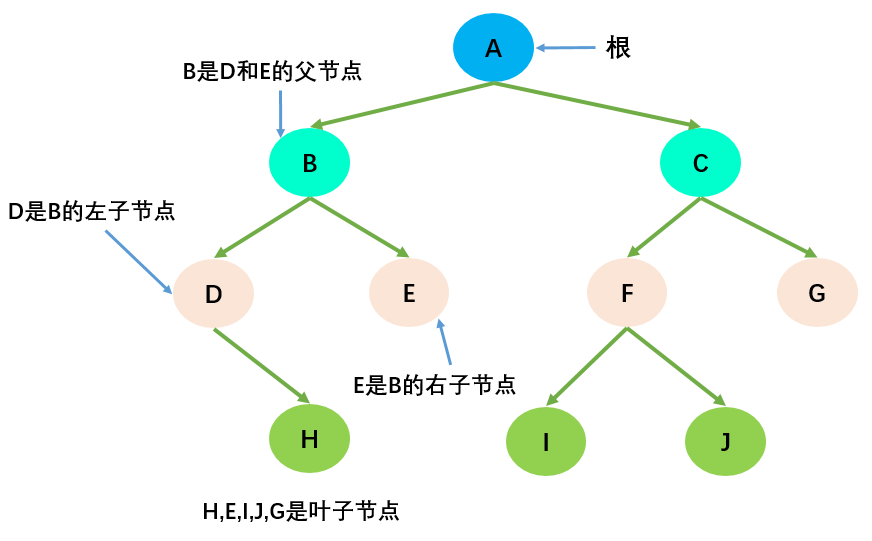
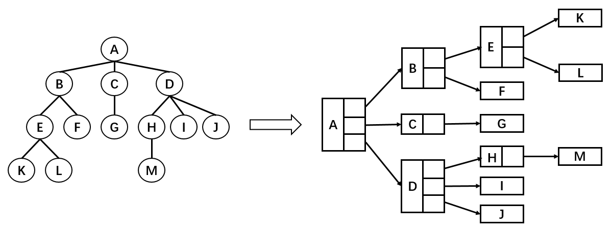
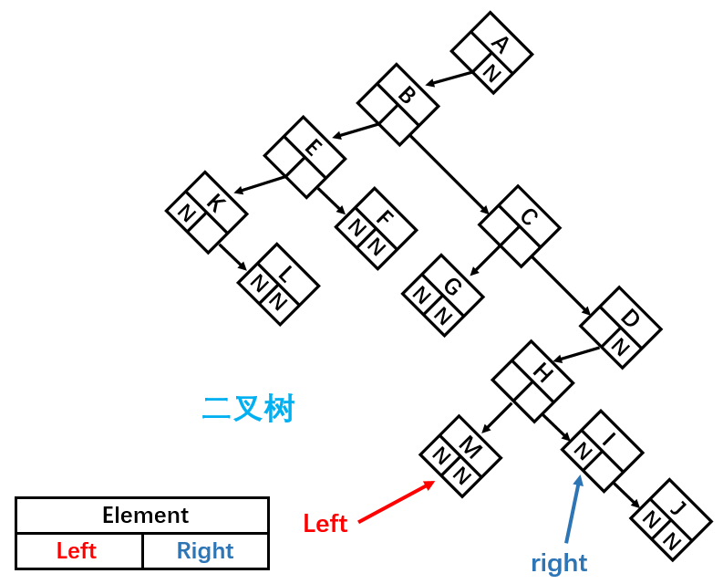

# 十一、树

### 什么是树？

#### 真实的树


#### 树的特点

- 树一般都有一个根，连接着根的是树干；
- 树干会发生分叉，形成许多树枝，树枝会继续分化成更小的树枝；
- 树枝的最后是叶子；

现实生活中很多结构都是树的抽象，模拟的树结构相当于旋转 `180°` 的树。


#### 树结构对比于数组/链表/哈希表有哪些优势呢？

数组：

- 优点：可以通过下标值访问，效率高；
- 缺点：查找数据时需要先对数据进行排序，生成有序数组，才能提高查找效率；并且在插入和删除元素时，需要大量的位移操作；

链表：

- 优点：数据的插入和删除操作效率都很高；
- 缺点：查找效率低，需要从头开始依次查找，直到找到目标数据为止；当需要在链表中间位置插入或删除数据时，插入或删除的效率都不高。

哈希表：

- 优点：哈希表的插入/查询/删除效率都非常高；
- 缺点：空间利用率不高，底层使用的数组中很多单元没有被利用；并且哈希表中的元素是无序的，不能按照固定顺序遍历哈希表中的元素；而且不能快速找出哈希表中最大值或最小值这些特殊值。

树结构：

- 优点：树结构综合了上述三种结构的优点，同时也弥补了它们存在的缺点（虽然效率不一定都比它们高），比如树结构中数据都是有序的，查找效率高；空间利用率高；并且可以快速获取最大值和最小值等。

总的来说：每种数据结构都有自己特定的应用场景。

树结构：

- 树（Tree）：由 n（n ≥ 0）个节点构成的有限集合。当 n = 0 时，称为空树。
- 对于任意一棵非空树（n > 0），它具备以下性质：
  - 数中有一个称为根（Root）的特殊节点，用 **r** 表示；
  - 其余节点可分为 m（m > 0）个互不相交的有限集合 T1，T2，…，Tm，其中每个集合本身又是一棵树，称为原来树的子树（SubTree）。

#### 树的常用术语



- 节点的度（Degree）：节点的子树个数，比如节点 B 的度为 2；
- 树的度：树的所有节点中最大的度数，如上图树的度为 2；
- 叶节点（Leaf）：度为 0 的节点（也称为叶子节点），如上图的 H，I 等；
- 父节点（Parent）：度不为 0 的节点称为父节点，如上图节点 B 是节点 D 和 E 的父节点；
- 子节点（Child）：若 B 是 D 的父节点，那么 D 就是 B 的子节点；
- 兄弟节点（Sibling）：具有同一父节点的各节点彼此是兄弟节点，比如上图的 B 和 C，D 和 E 互为兄弟节点；
- 路径和路径长度：路径指的是一个节点到另一节点的通道，路径所包含边的个数称为路径长度，比如 A->H 的路径长度为 3；
- 节点的层次（Level）：规定根节点在 1 层，其他任一节点的层数是其父节点的层数加 1。如 B 和 C 节点的层次为 2；
- 树的深度（Depth）：树种所有节点中的最大层次是这棵树的深度，如上图树的深度为 4；

#### 树结构的表示方式

##### 最普通的表示方法



如图，树结构的组成方式类似于链表，都是由一个个节点连接构成。不过，根据每个父节点子节点数量的不同，每一个父节点需要的引用数量也不同。比如节点 A 需要 3 个引用，分别指向子节点 B，C，D；B 节点需要 2 个引用，分别指向子节点 E 和 F；K 节点由于没有子节点，所以不需要引用。

这种方法缺点在于我们无法确定某一结点的引用数。

##### 儿子-兄弟表示法


这种表示方法可以完整地记录每个节点的数据，比如：

```js
//节点A
Node{
  //存储数据
  this.data = data
  //统一只记录左边的子节点
  this.leftChild = B
  //统一只记录右边的第一个兄弟节点
  this.rightSibling = null
}

//节点B
Node{
  this.data = data
  this.leftChild = E
  this.rightSibling = C
}

//节点F
Node{
  this.data = data
  this.leftChild = null
  this.rightSibling = null
}
```

这种表示法的优点在于每一个节点中引用的数量都是确定的。

##### 儿子-兄弟表示法旋转

以下为儿子-兄弟表示法组成的树结构：


将其顺时针旋转 45° 之后：



这样就成为了一棵二叉树，由此我们可以得出结论：任何树都可以通过二叉树进行模拟。但是这样父节点不是变了吗？其实，父节点的设置只是为了方便指向子节点，在代码实现中谁是父节点并没有关系，只要能正确找到对应节点即可。
