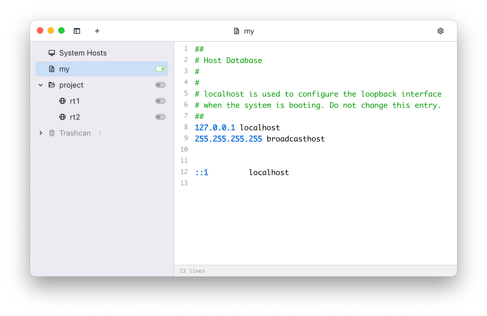

# Git 报错

## 1.问题描述

使用 Git 同步分支报错

## 2.报错信息

```bash
fatal: unable to access 'https://github.com/xxx/xxx.git/': Failed to connect to github.com port 443 after 75005 ms: Operation timed out
```

## 3.解决办法

### 3.1 记录 github.com 的 ip 地址

点击[传送门](https://sites.ipaddress.com/github.com/)，页面下方输入 github.com 搜索


搜索结果：140.82.112.3

### 3.2 修改系统 hosts 文件

#### 3.2.1. 终端修改

**Mac:**
打开终端，sudo vim /etc/hosts，按`i`进入编辑模式,将刚才复制的 IP Address 写入 hosts 文件中，`140.82.114.3 github.com`，然后再按`esc`退出编辑模式,最后`:wq`退出保存即可！！

**Windows:**
win10：Hosts 文件在 C:\Windows\System32\drivers\etc 目录下,手动进入修改

#### 3.2.2 SwitchHosts（不感冒终端开发者的福音，推荐使用！！）

github 地址：[https://github.com/oldj/SwitchHosts](https://github.com/oldj/SwitchHosts)

下载（需要 🪜） 🔗：[https://switchhosts.vercel.app/zh](https://switchhosts.vercel.app/zh)



### 3.3 修改https.proxy

```bash
git config --global https.proxy http://127.0.0.1:7890
git config --global http.proxy http://127.0.0.1:7890
```

### 3.4 重置https.proxy

```bash
git config --global --unset http.proxy 
git config --global --unset https.proxy 
```

