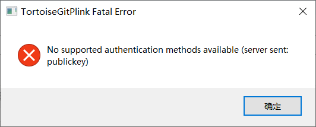
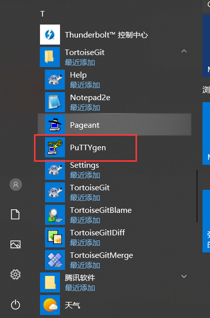
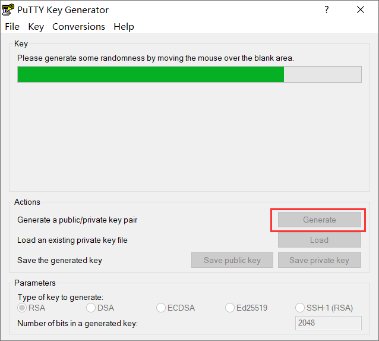
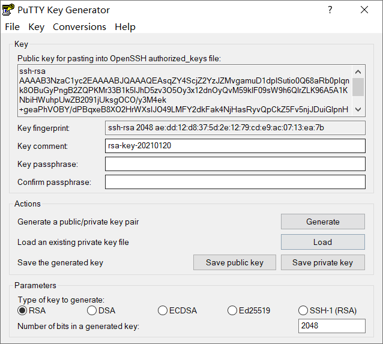
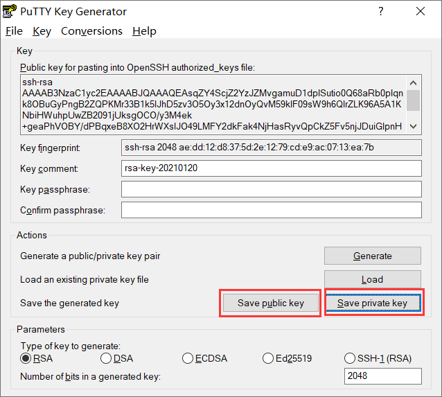
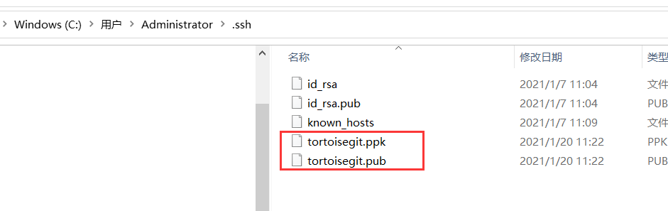
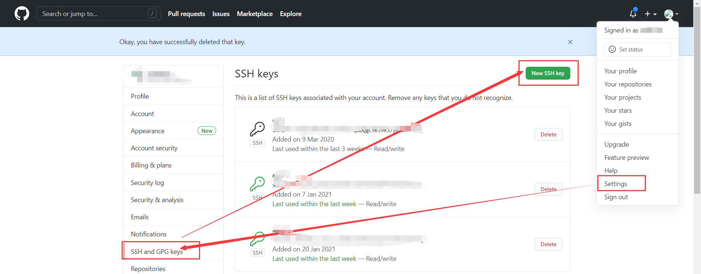
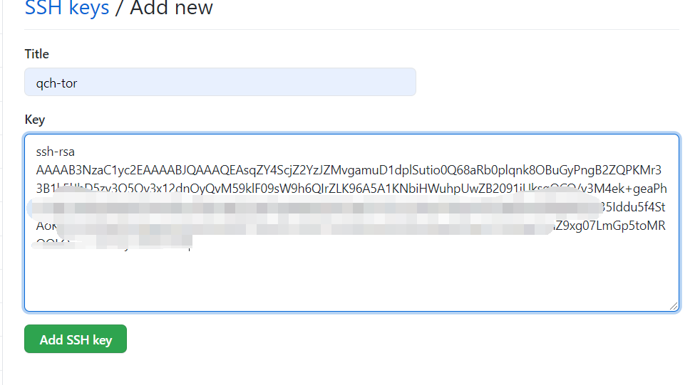
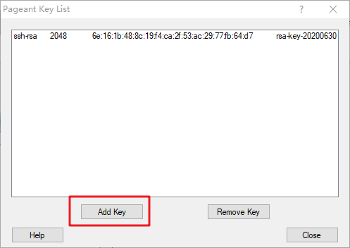
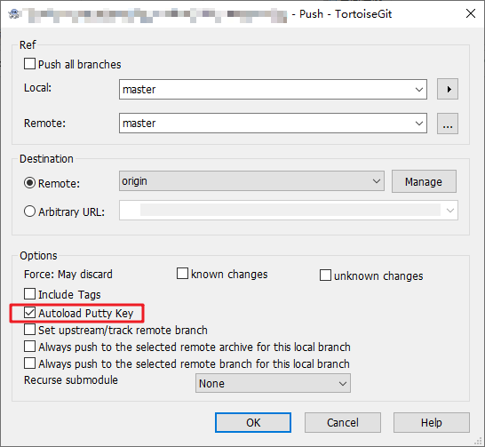

# TortoiseGit clone 项目时报错

## 1.问题描述

使用 TortoiseGit 工具将 gitee 项目 clone 到本地目录时出现异常

## 2.报错信息

```shell
No supported authentication methods available (server sent: publickey)
```



## 3.解决办法

### 3.1 使用 puttygen 生成 key 公钥



### 3.2 点击 generate 生成公钥和私钥



执行一段时间之后如下



保存公钥和私钥到本地



我保存的位置



将公钥放到 git 账号上，路径：账号 →settings→SSH and GPG keys



执行 Add SSH key



### 3.3 使用 Pageant 程序配置私钥

运行 TortoiseGit 开始菜单中的 Pageant 程序，程序启动后将自动停靠在任务栏中，在任务栏中双击打开。

点击“Add Key”按钮，添加之前保存的私钥（.ppk），然后点击“Close”即可。它会默认在后台挂载私钥，如果程序退出，配置就会失效。



再执行 git 操作的时候，就不会报错了。

### 3.4 在设置中配置私钥，永久有效

在本地项目文件夹上右键，TortoiseGit -》Settings -》Git -》 Remote，在 Putty Key 后选择刚才保存到本地的私钥，然后点击应用即可。


在 Pull 或 Push 项目的时候，记得勾选 Autoload Putty Key 选项。



最后就可以使用 TortoiseGit 可视化提交工具进行代码拉取提交等一系列操作了。
